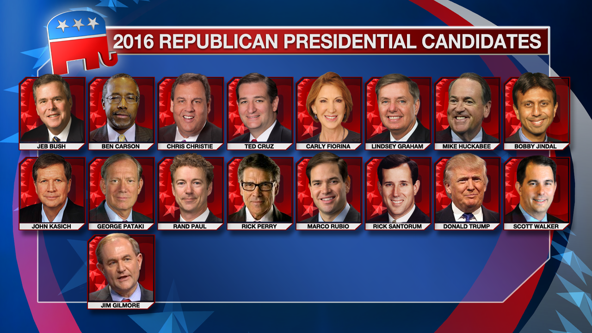

_"No existeix la publicitat dolenta Tota publicitat és bona publicitat"_

_-Phineas T. Barnum, fundador del Circ Barnum Brothers_


```{r setup, include=FALSE, echo = FALSE}
# Basic knitr options
library(knitr)
ab <- 0.5625
size_factor <- 7
fw <- size_factor
fh <- fw * ab
opts_chunk$set(comment = NA, 
               echo = FALSE, 
               warning = FALSE, 
               message = FALSE, 
               error = TRUE, 
               cache = FALSE,
               fig.width = fw,
               fig.height = fh,
               fig.path = 'figures/')
```


```{r}
# Libraries
library(vilaweb)
library(tidyverse)
library(databrew)
require(readr)  
library(ggrepel)
```

```{r}
newspapers <- vilaweb::spanish_newspapers
library(DBI)
library(RPostgreSQL)

# Write strings to search for each party
party_dict <-
  tibble(
    party = c(
      "Cs",
      "PP/PPC",
      "VOX",
      "PSOE/PSC",
      "Junts/PDeCat",
      "Podemos",
      "ERC",
      "CUP"),
    string = c("ciudadanos|ciutadans| c's| cs ",
               "partido popular|partit popular|el ppc|el pp",
               "vox",
               "psoe|psc|socialista|socialiste",
               "junts per cat|pdecat",
               "podemos|en comú podem|encomu_podem",
               "esquerra republi| erc",
               " cup "))

if(file.exists('tl2.RData')){
  load('tl2.RData')
} else {
  
  if(file.exists('tl.RData')){
  load('tl.RData')
} else {
  # Connect to the db
  pg = DBI::dbDriver("PostgreSQL")
  con = DBI::dbConnect(pg, dbname="twitter")
  tl <- RPostgreSQL::dbGetQuery(
    con,
    paste0("SELECT * FROM twitter where date > '2018-11-30'")
  )
  save(tl, file = 'tl.RData')  
  dbDisconnect(con)
}
tl_original <- tl
tl <- tl %>%
  filter(tolower(username) %in% tolower(newspapers$username))
x <- tl %>%
  group_by(username) %>%
  summarise(max_date = max(date),
           min_date = min(date))
 for(i in 1:nrow(party_dict)){
    message(i, ' of ', nrow(party_dict))
    this_party <- party_dict$party[i]  
    this_string <- party_dict$string[i]
    this_column <- tolower(this_party)
    tl[,this_column] <- NA
    tl[,this_column] <- grepl(this_string, tolower(tl$tweet))
  }
    
  save(tl, file = 'tl2.RData')
}

tl <- tl %>% filter(date >= '2018-12-01',
                    date <= '2019-04-09')

# Remove tvs
tl <- tl %>%
  filter(!tolower(username) %in% c('tv3cat', "lindependant", 'rtve','ccma_cat'))

# Fix newspaper names
newspapers$name[newspapers$name == 'Cadana Ser'] <- 'Cadena Ser'
newspapers$name[newspapers$name == 'E-noticies'] <- 'E-notícies'
```

# Introducció

## Com va guanyar Trump les eleccions de 2016

M'en recordo, amb un cert nivell d'incomoditat, de les eleccions presidencials als Estats Units en 2016. En el partit demòcrata, n'hi havia basicament dos candidats: la Hillary Clinton i el Bernie Sanders. Però en el partit republicà, n'hi havia més d'una dotzena! Gobernadors i senadors, tots amb moltíssima experiència política. Menys un: el Donald Trump.



_Image from Fox News_

Els diaris americans publicaven titulars cada dia sobre Trump. Les televisions gairebé van oblidar dels altres candidats, creant cadenes de notícies Trump 24 hores al dia. La gana de notícies sobre Trump era universal, tant de la dreta que de l'esquerra. Com més un diari parlava de Trump, més "clicks" rebia dels lectors. I, per tant, parlaven molt de Trump.

El nivell d'atenció mediàtica era tan desproporcionada que tenia jo la impressió que Trump era l'únic candidat del partit republicà. I al llarg del temps, gràcies a la cobertura universal i constant de la seva campanya, Trump va convertir-se en exactament això: l'únic candidat. I va continuar la cosa després de les primaries també: entre informar sobre una proposta política de la candidata Hillary Clinton o un disbarat del candidat Donald Trump, tots els diaris escollien la segona opció. Trump va ser bo pels diaris. I els diaris van ser bons pel Trump.

Trump va guanyar la elecció general de 2016, i ara és president dels Estats Units. Un mentider compulsiu, racista, xenòfob, i machista és el líder del pais més poderós del món. I de qui és la culpa?

[Un estudi de Harvard](https://cyber.harvard.edu/publications/2017/08/mediacloud) demostra que la premsa va donar una cobertura molt favorable a Trump, parlant desproporcionalment de les polémiques que el proposava (l'Islam i la immigració). Hillary Clinton, el rival de Trump que va perdre, comparteix la opinió que la cobertura mediatica constant va crear un escenari electoral que favoria el candidat més extrem i menys experimentat. "He de reconeixer", va escriure Clinton en el seu llibre, "que Trump és odiós però que és dificil no mirar-ho".

## La historia es repeteix

Observo la pre-campanya de les eleccions espanyoles del 28A amb una certa sensació de "déjà vu". VOX, un partit d'extrema dreta amb tendencies xenófobes i machistes, atrau l'atenció de tots. Com que les seves propostes són tan extremes, obliga als candidats de partits menys extrems de posicionar-se sempre en referència a VOX. I tot i que el partit provoqui un rebuig moral en grans sectors de la política catalana i espanyola, "és dificil no mirar-ho", com va dir Clinton. La premsa, em sembla, mira més a VOX que a altres partits.

Però potser m'equivoqui. Potser estigui "projectant" una experiència del passat (la victoria de Trump) a un present totalment different. Potser les premses espanyoles i catalanes donin una cobertura justa i equitable als diferents partits polítics, i jo no hauria de preocupar-me tant. Potser.

Vull saber la resposta. Avui mirarem amb quina freqüencia els mitjans parlen dels partits polítics. Amb dades.

# Métodes

Vaig descarregar `r nrow(tl)` piulets dels comptes de `r length(unique(tl$username))` diaris espanyols i catalans del 1 de desembre de 2018 fins al 9 d'abril de 2019. La meva intenció era identificar referències a partits polítics en aquests piulets. Amb mitg-millió de piulets, no era possible una lectura humana de cada piulet; per tant, vaig identificar les referències a través d'una busqueda automatitzada (detalls técnics al final de l'article) de referències als partits següents: `r cat(paste0(party_dict$party, collapse = ', '))`.

# Resultats

```{r}
tl <- tl %>%
  mutate(any_party = cs | `pp/ppc` | vox | `psoe/psc` | `junts/pdecat` | podemos | erc | cup)
```

Dels `r nrow(tl)` piulets dels `r length(unique(tl$username))` mitjans, `r round(length(which(tl$any_party)) / length(tl$any_party) * 100, digits = 2)` van esmentar un partit. Però aquestes esmentades no eran distribuides de manera uniforme per partit, ni de manera representativa. Aqui el percentatge de tots els piulets que esmentaven cadascú dels partits examinats.


```{r}
countify <- function(tlx){
  pd <- party_dict
  pd$n <- NA
  for(i in 1:nrow(pd)){
    # message(i, ' of ', nrow(pd))
    this_party <- pd$party[i]  
    this_string <- pd$string[i]
    this_column <- tolower(this_party)
    any_mentions <- length(which(tlx$any_party))
    keep <- tlx[tlx[,this_column],] %>%
      mutate(party = this_party)
    pd$n[i] <- nrow(keep)
  }
  pd$p <- pd$n / nrow(tl) * 100
  pd$pp <- pd$n / nrow(tlx) * 100
  pd$of_parties <- pd$n / any_mentions * 100
  return(pd)
}

party_dict <- countify(tlx = tl)

ggplot(data = party_dict,
       aes(x = party,
           y = pp)) +
  geom_point() +
  geom_segment(aes(xend = party,
                   yend = 0,
                   x = party,
                   y = pp)) +
  geom_text(aes(label = round(pp, digits = 2)),
            nudge_y = 0.3,
            alpha = 0.7,
            size = 4) +
  theme_vilaweb() +
  labs(x = 'Partit',
       y = 'Percentatge',
       title = '% de piulets de mitjans esmentant partits',
       subtitle = '1 de desembre 2018 - 9 d\'abril 2019')
```

El gràfic anterior mostra el percentatge de piulets que fan referència a cada partit de _tots el piulets_ de tots el mitjans. Però és útil mirar també aquest percentatge només entre aquells piulets que esmenten algún partit (per excloure piluets no polítics, etc.):

```{r}
ggplot(data = party_dict,
       aes(x = party,
           y = of_parties)) +
  geom_point() +
  geom_segment(aes(xend = party,
                   yend = 0,
                   x = party,
                   y = of_parties)) +
  geom_text(aes(label = round(of_parties, digits = 2)),
            nudge_y = 5,
            alpha = 0.7,
            size = 4) +
  theme_vilaweb() +
  labs(x = 'Partit',
       y = 'Percentatge',
       title = '% de piulets de mitjans esmentant partits',
       subtitle = '(només incloent piulets que esmenten, com a mínim, un partit polític)\n1 de desembre 2018 - 9 d\'abril 2019')
```

VOX, segons el CIS, és el cinquè partit d'Espanya. El seu support fluctuava durants el mesos d'aquest análisi de 5% a 11%. Però en cobertura mediàtica és el primer. Dels mitjans examinats, 34% dels piulets que esmenten un partit polític fan referència a VOX. Va ser així amb Trump, al principi de les primàries. Tot i que la majoria dels republicans preferessin un altre candidat, Trump rebia constantment més cobertura, el que li va convertir - al llarg del temps - en el candidat més preferit.

## Per mitjà

No tots els mitjans esmenten VOX amb el mateix nivell de desproporcionalitat. Mirem-ho. El gràfic següent mostra el percentatge de tots els piulets de cada mitjà que fa referència a VOX.

```{r}
mitjans <- sort(unique(tl$username))
out_list <- list()
for(i in 1:length(mitjans)){
  this_mitja <- mitjans[i]
  tlx <- tl %>% filter(username == this_mitja)
  out <- countify(tlx = tlx)
  out <- out %>%
    mutate(newspaper = this_mitja) %>%
    dplyr::select(newspaper, party, n, p,pp, of_parties)
  out_list[[i]] <- out
}
pd <- bind_rows(out_list)
```

```{r}
x <- pd %>%
  filter(party == 'VOX')
x <- left_join(x %>% 
                 dplyr::rename(username = newspaper), spanish_newspapers %>%
                 mutate(username = tolower(username)))

ggplot(data = x,
       aes(x = name,
           y = pp)) +
  geom_bar(stat = 'identity' ) +
  theme_vilaweb() +
  theme(axis.text.x = element_text(angle = 90,
                                   hjust = 1, 
                                   vjust = 0.5)) +
  labs(x = '',
       y = '%',
       title = '% de piulets que esmenten VOX',
       subtitle = '1 de desembre 2018 - 9 d\'abril 2019' ) +
    geom_text(aes(label = round(pp, digits = 1)),
            alpha = 0.8,
            color = 'black',
            size = 2,
            nudge_y = 0.5)

```

El problema amb el gràfic anterior és que alguns mitjans no parlen molt de la política i els partits en general, i altres molt. Per tant, estaria bé mirar quin percentatge de piulets _que esmenten algun partit polític_ fan referència a VOX. Això es veu al gràfic següent.

```{r}
ggplot(data = x,
       aes(x = name,
           y = of_parties)) +
  geom_bar(stat = 'identity' ) +
  theme_vilaweb() +
  theme(axis.text.x = element_text(angle = 90,
                                   hjust = 1, 
                                   vjust = 0.5)) +
  labs(x = '',
       y = '%',
       title = '% de piulets que esmenten VOX',
       subtitle = '(només incloent piulets que estmenten, com a mínim, un partit polític)\n1 de desembre 2018 - 9 d\'abril 2019' ) +
  geom_text(aes(label = round(of_parties, digits = 1)),
            alpha = 0.8,
            color = 'white',
            size = 2,
            nudge_y = -4)
```

No hi ha un patró clar esquerra-dreta amb la freqüencia de referències a VOX. Ho fan molt, i ho fan tots.

També es pot analitzar, mitjà per mitjà, la distribució de referencies als partits (gràfics al final d'aquest article).

# Conclusió

Els mitjans catalans i espanyols donen una cobertura molt desproporcionada a VOX. Un partit que rep aproximadament 10% de suport en la població de l'Estat espanyol rep 34% de la cobertura mediática sobre els partits. Aquest comportament mediàtic - la cobertura constant - va ajudar al Donald Trump a guanyar les eleccions americanes de 2016.

S'ha de preguntar: per què parlem tant de VOX? Per què donem una cobertura mediàtica tan exagerada a un partit extremament minoritari? Els culpables som molts: els mitjans (incloent aquest!), els ciutadans, les xarxes, etc. Escric aquestes preguntes amb el reconeixement ple de la ironía d'aquest article (que contribueix també a la cobertura desproporcionada de VOX).

Els mitjans haurien de fer una reflexió sobre el que és d'interès periodístic, i el que no. Una proposta política d'un partit, per exmple, ho és. Un meeting de 1000 persones en una plaça de toros - potser no. Canviar la dinámica actual per a evitar un error com el que vem cometre els americans en 2016 significaria, potser, que els mitjans haurien de passar-se d'escriure articles molt "clickables" (els de VOX ho son), per a escriure articles més rellevants. Això, però, es demanar que perdin diners. I per això no passarà.

Durant les properes setmanes és molt probables que els mitjans continuan donant una cobertura desproprocionada a VOX. No és per alguna conspiració de l'extrema dreta. És perquè per nosaltres, els lectors, "és dificil no mirar-ho" (dixit Clinton). El cicle viciós continua. Els resultats d'aquest cicle, els sabrem el 28 d'abril.

# Gràfics per mitjà

```{r}
mitja_plot <- function(mitja = 'vilaweb' ){
  this_tlx <- tl %>% filter(tolower(username) == mitja)
  out <- countify(tlx = this_tlx)
  out <- out %>%
    mutate(newspaper = mitja) %>%
    dplyr::select(newspaper, party, n, p,pp, of_parties)
  pdx <- out %>%
    gather(key, value, pp:of_parties)
  pdx$key <- ifelse(pdx$key == 'of_parties',
                    'Només entre aquells piulets\nque esmenten algun partit',
                    'Entre tots els piulets\ndel compte')
  
  the_title <- spanish_newspapers$name[tolower(spanish_newspapers$username) == mitja]

  ggplot(data = pdx,
         aes(x = party,
             y = value)) +
    geom_bar(stat = 'identity') +
    facet_wrap(~key,
               scales = 'free_y') +
    theme_vilaweb() +
    theme(axis.text.x = element_text(angle = 90,
                                     hjust = 1,
                                     vjust = 0.5)) +
    labs(x = '',
         y = '%',
         title = paste0(the_title, ' (@', mitja, ')'),
         subtitle = 'Percentatge de piulets que esmenten partits polítics')
}

mitjans <- sort(unique(tl$username))
out_list <- list()
for(i in 1:length(mitjans)){
  print(mitja_plot(mitja = mitjans[i]))
}
```


# Detalls tècnics

## La búsqueda

```{r}
party_dict %>%
  dplyr::select(party, string)
```