Si us plau, pareu de parlar tant de VOX
================

*"No existeix la publicitat dolenta Tota publicitat és bona publicitat"*

*-Phineas T. Barnum, fundador del Circ Barnum Brothers*

Introducció
===========

Com va guanyar Trump les eleccions de 2016
------------------------------------------

M'en recordo, amb un cert nivell d'incomoditat, de les eleccions presidencials als Estats Units en 2016. En el partit demòcrata, n'hi havia basicament dos candidats: la Hillary Clinton i el Bernie Sanders. Però en el partit republicà, n'hi havia més d'una dotzena! Gobernadors i senadors, tots amb moltíssima experiència política. Menys un: el Donald Trump.

*Image from Fox News*

Els diaris americans publicaven titulars cada dia sobre Trump. Les televisions gairebé van oblidar dels altres candidats, creant cadenes de notícies Trump 24 hores al dia. La gana de notícies sobre Trump era universal, tant de la dreta que de l'esquerra. Com més un diari parlava de Trump, més "clicks" rebia dels lectors. I, per tant, parlaven molt de Trump.

El nivell d'atenció mediàtica era tan desproporcionada que tenia jo la impressió que Trump era l'únic candidat del partit republicà. I al llarg del temps, gràcies a la cobertura universal i constant de la seva campanya, Trump va convertir-se en exactament això: l'únic candidat. I va continuar la cosa després de les primaries també: entre informar sobre una proposta política de la candidata Hillary Clinton o un disbarat del candidat Donald Trump, tots els diaris escollien la segona opció. Trump va ser bo pels diaris. I els diaris van ser bons pel Trump.

Trump va guanyar la elecció general de 2016, i ara és president dels Estats Units. Un mentider compulsiu, racista, xenòfob, i machista és el líder del pais més poderós del món. I de qui és la culpa?

[Un estudi de Harvard](https://cyber.harvard.edu/publications/2017/08/mediacloud) demostra que la premsa va donar una cobertura molt favorable a Trump, parlant desproporcionalment de les polémiques que el proposava (l'Islam i la immigració). Hillary Clinton, el rival de Trump que va perdre, comparteix la opinió que la cobertura mediatica constant va crear un escenari electoral que favoria el candidat més extrem i menys experimentat. "He de reconeixer", va escriure Clinton en el seu llibre, "que Trump és odiós però que és dificil no mirar-ho".

La historia es repeteix
-----------------------

Observo la pre-campanya de les eleccions espanyoles del 28A amb una certa sensació de "déjà vu". VOX, un partit d'extrema dreta amb tendencies xenófobes i machistes, atrau l'atenció de tots. Com que les seves propostes són tan extremes, obliga als candidats de partits menys extrems de posicionar-se sempre en referència a VOX. I tot i que el partit provoqui un rebuig moral en grans sectors de la política catalana i espanyola, "és dificil no mirar-ho", com va dir Clinton. La premsa, em sembla, mira més a VOX que a altres partits.

Però potser m'equivoqui. Potser estigui "projectant" una experiència del passat (la victoria de Trump) a un present totalment different. Potser les premses espanyoles i catalanes donin una cobertura justa i equitable als diferents partits polítics, i jo no hauria de preocupar-me tant. Potser.

Vull saber la resposta. Avui mirarem amb quina freqüencia els mitjans parlen dels partits polítics. Amb dades.

Métodes
=======

Vaig descarregar 398229 piulets dels comptes de 29 diaris espanyols i catalans del 1 de desembre de 2018 fins al 9 d'abril de 2019. La meva intenció era identificar referències a partits polítics en aquests piulets. Amb mitg-millió de piulets, no era possible una lectura humana de cada piulet; per tant, vaig identificar les referències a través d'una busqueda automatitzada (detalls técnics al final de l'article) de referències als partits següents: .

Resultats
=========

Dels 398229 piulets dels 29 mitjans, 8.58 van mencionar un partit. Però aquestes mencions no eran distribuides de manera uniforme per partit, ni de manera representativa. Aqui el percentage de tots els piulets que mencionaven a cadascú dels partits examinats.

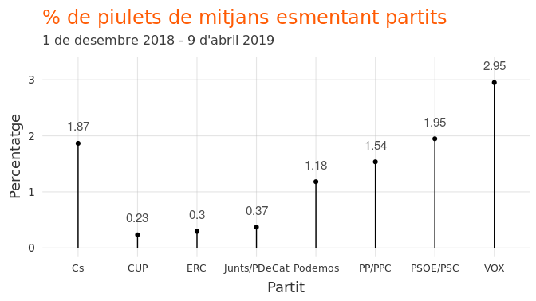

El gràfic anterior mostra el percentage de piulets que fan referència a cada partit de *tots el piulets* de tots el mitjans. Però és útil mirar també aquest percentage només entre aquells piulets que mencionen algún partit (per excloure piluets no polítics, etc.):

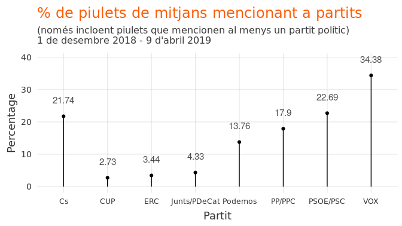

VOX, segons el CIS, és el cinquè partit d'Espanya. El seu support fluctuava durants el mesos d'aquest análisi de 5% a 11%. Però en cobertura mediàtica és el primer. Dels mitjans examinats, 34% dels piulets que mencionen a un partit polític fan referència a VOX. Va ser així amb Trump, al principi de les primàries. Tot i que la majoria dels republicans preferessin un altre candidat, Trump rebia constantment més cobertura, el que li va convertir - al llarg del temps - en el candidat més preferit.

Per mitjà
---------

No tots els mitjans mencionen a VOX amb el mateix nivell de desproporcionalitat. Mirem-ho. El gràfic següent mostra el percentage de tots els piulets de cada mitjà que fa referència a VOX.

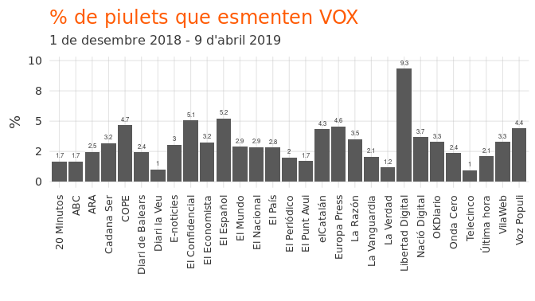

El problema amb el gràfic anterior és que alguns mitjans no parlen molt de la política i els partits en general, i altres molt. Per tant, estaria bé mirar quin percentage de piulets *que mencionen algun partit polític* fan referència a VOX. Això es veu al gràfic següent.

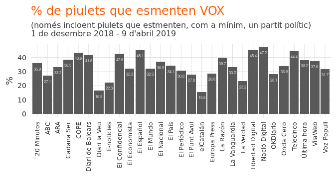

No hi ha un patró clar esquerra-dreta amb la freqüencia de mencions de VOX. Ho fan molt, i ho fan tots.

També es pot analitzar, mitjà per mitjà, la distribució de referencies als partits (gràfics al final d'aquest article).

Conclusió
=========

Els mitjans catalans i espanyols donen una cobertura molt desproporcionada a VOX. Un partit que rep aproximadament 10% de suport en la població de l'Estat espanyol rep 34% de la cobertura mediática sobre els partits. Aquest comportament mediàtic - la cobertura constant - va ajudar al Donald Trump a guanyar les eleccions americanes de 2016.

S'ha de preguntar: per què parlem tant de VOX? Per què donem una cobertura mediàtica tan exagerada a un partit extremament minoritari? Els culpables som molts: els mitjans (incloent aquest!), els ciutadans, les xarxes, etc. Escric aquestes preguntes amb el reconeixement ple de la ironía d'aquest article (que contribueix també a la cobertura desproporcionada de VOX).

Els mitjans haurien de fer una reflexió sobre el que és d'interès periodístic, i el que no. Una proposta política d'un partit, per exmple, ho és. Un meeting de 1000 persones en una plaça de toros - potser no. Canviar la dinámica actual per a evitar un error com el que vem cometre els americans en 2016 significaria, potser, que els mitjans haurien de passar-se d'escriure articles molt "clickables" (els de VOX ho son), per a escriure articles més rellevants. Això, però, es demanar que perdin diners. I per això no passarà.

Durant les properes setmanes és molt probables que els mitjans continuan donant una cobertura desproprocionada a VOX. No és per alguna conspiració de l'extrema dreta. És perquè per nosaltres, els lectors, "és dificil no mirar-ho" (dixit Clinton). El cicle viciós continua. Els resultats d'aquest cicle, els sabrem el 28 d'abril.

Gràfics per mitjà
=================

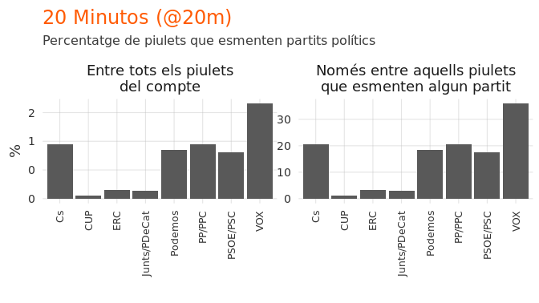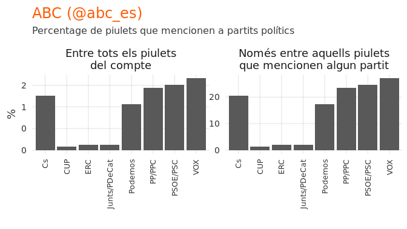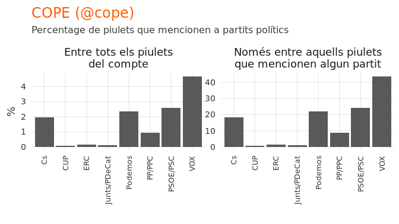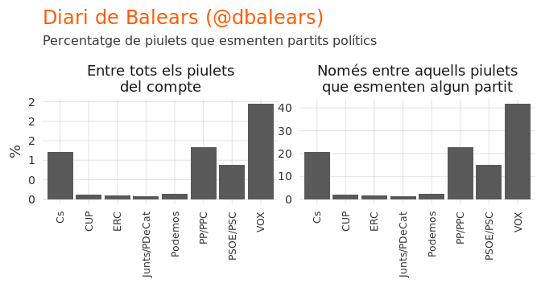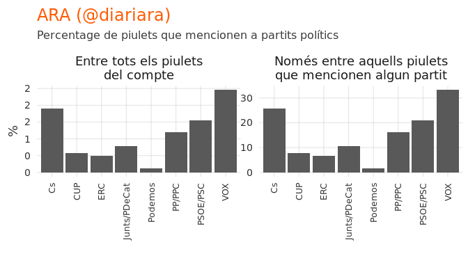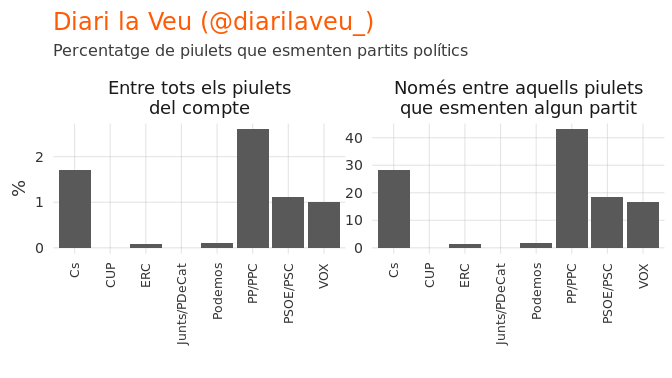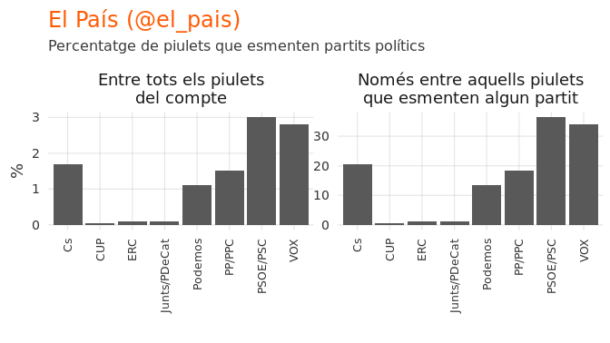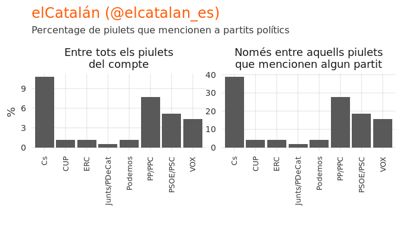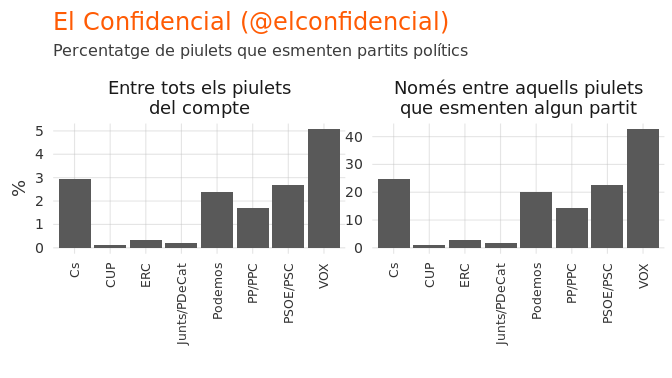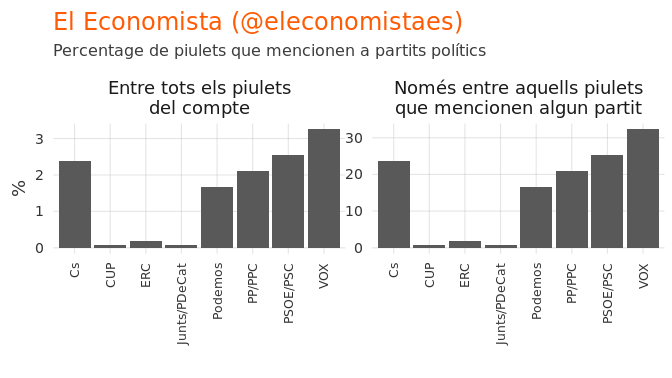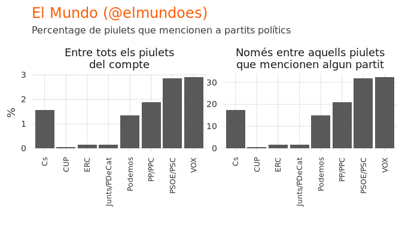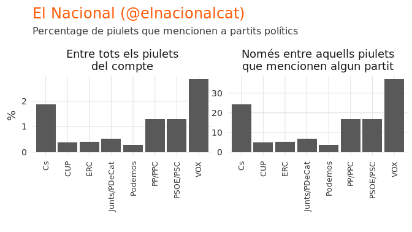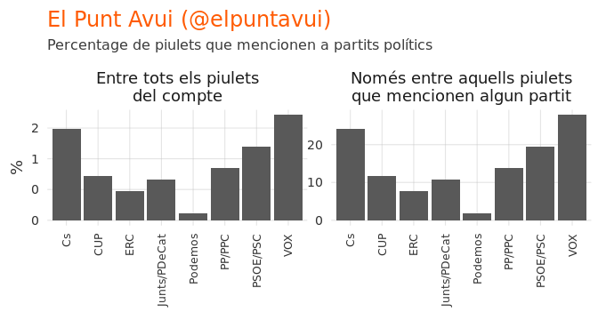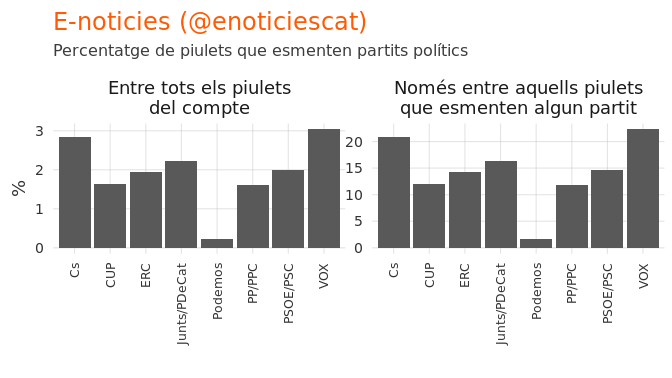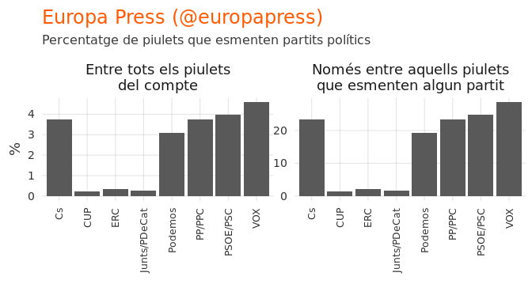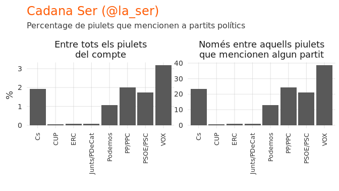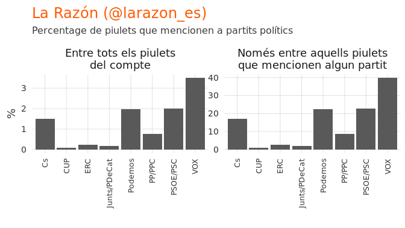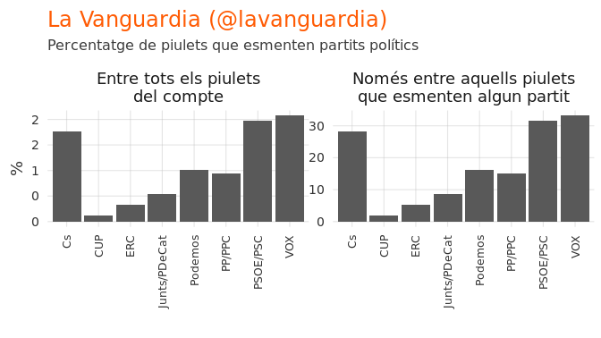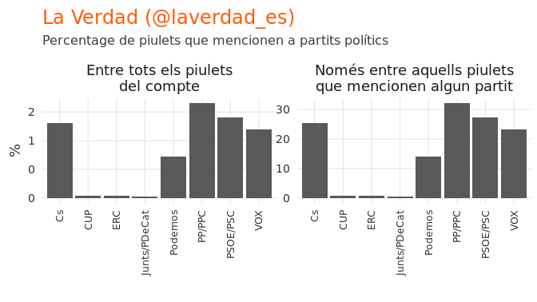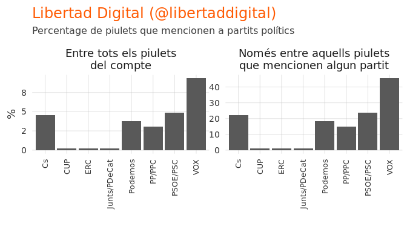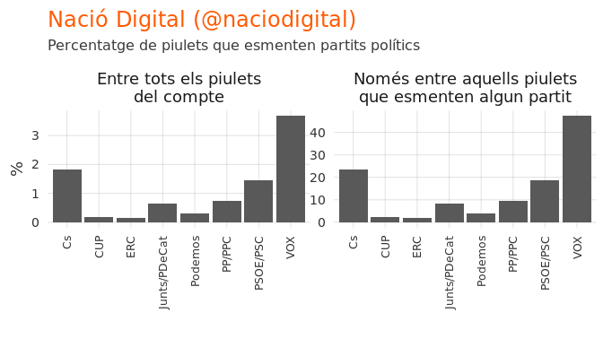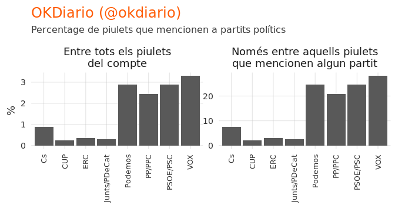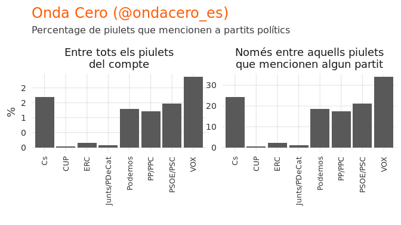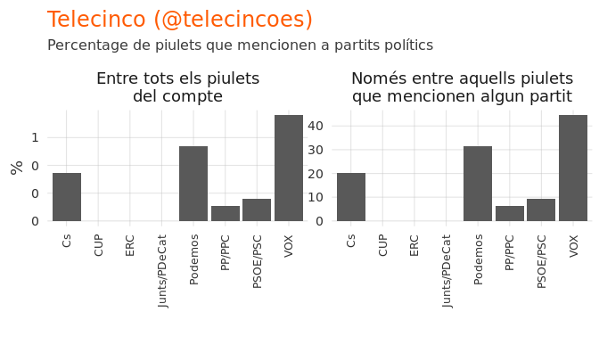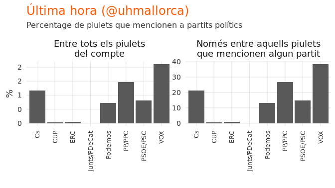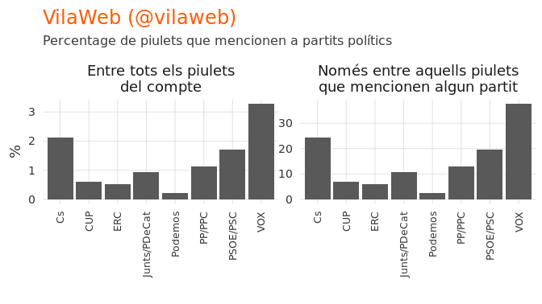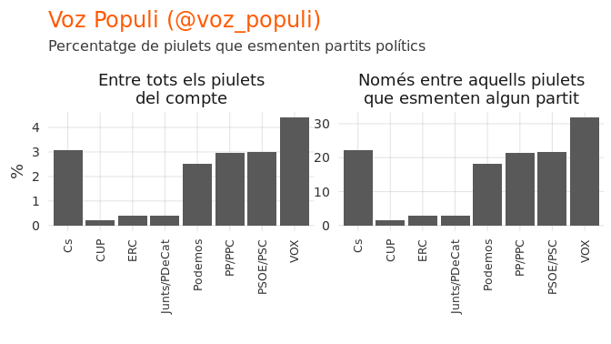

Detalls tècnics
===============

La búsqueda
-----------

    # A tibble: 8 x 2
      party        string                                     
      <chr>        <chr>                                      
    1 Cs           "ciudadanos|ciutadans| c's| cs "           
    2 PP/PPC       partido popular|partit popular|el ppc|el pp
    3 VOX          vox                                        
    4 PSOE/PSC     psoe|psc|socialista|socialiste             
    5 Junts/PDeCat junts per cat|pdecat                       
    6 Podemos      podemos|en comú podem|encomu_podem         
    7 ERC          esquerra republi| erc                      
    8 CUP          " cup "
