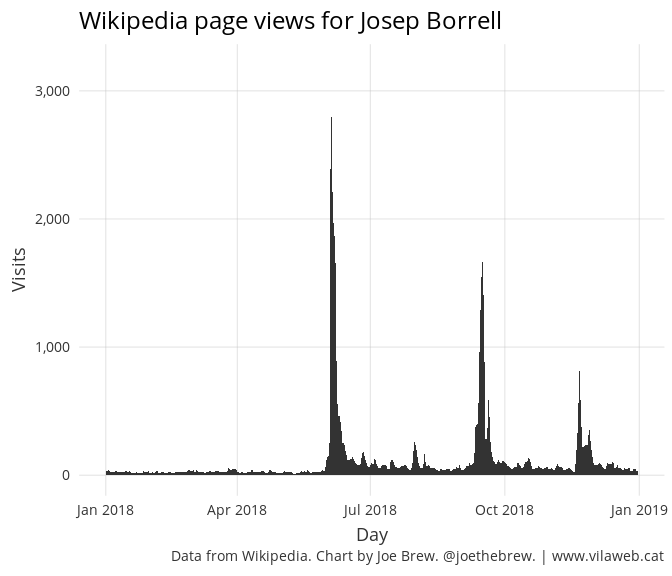
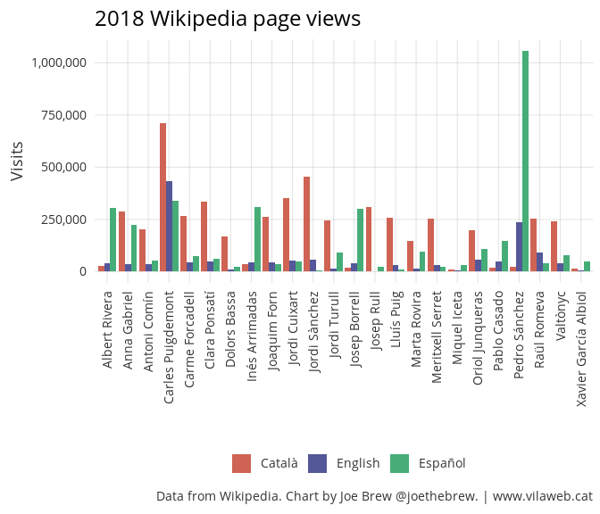
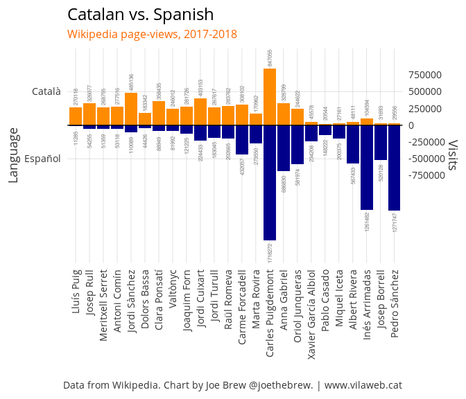
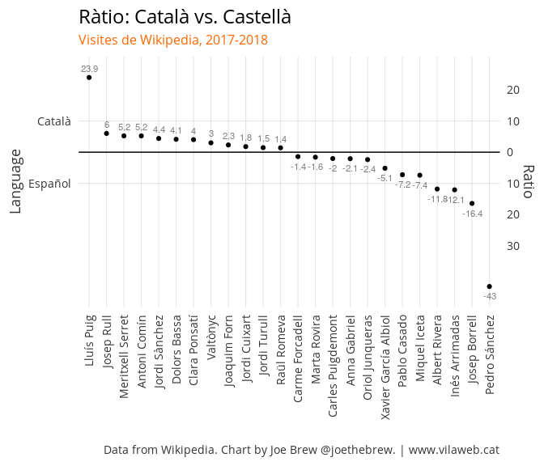
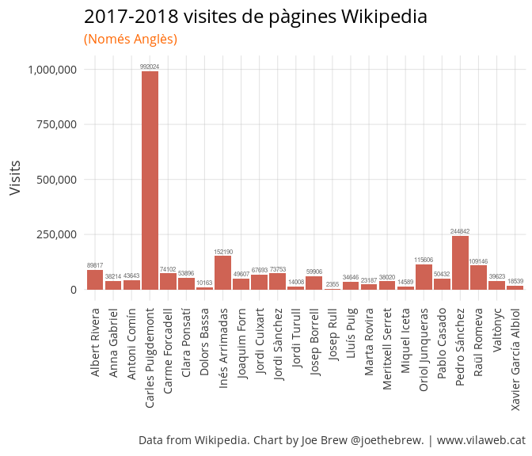
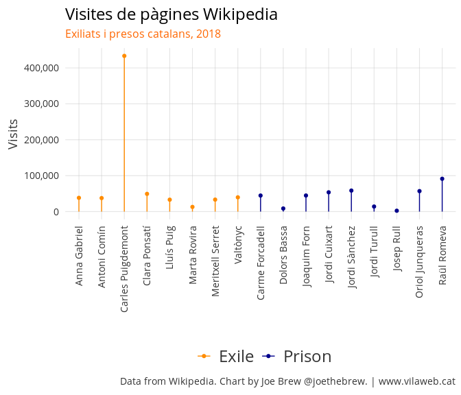
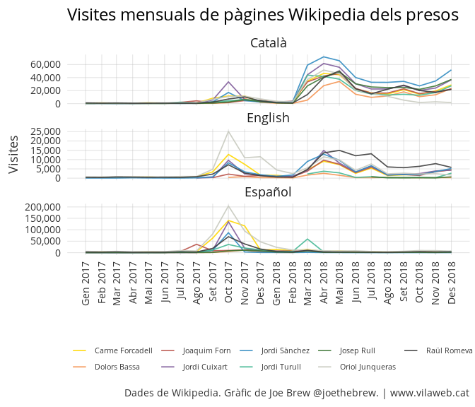
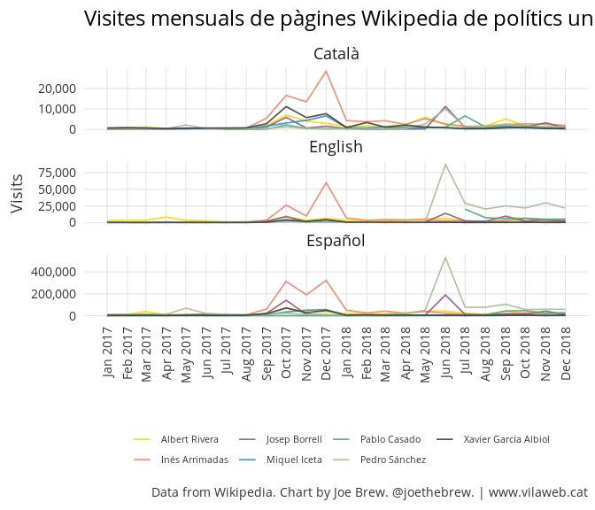
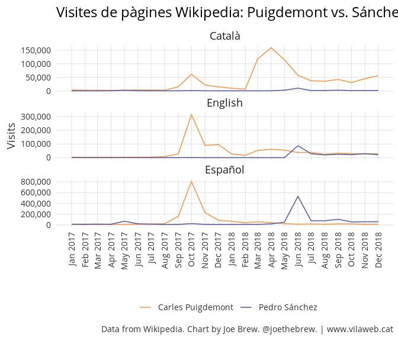

Global interest in Catalan and Spanish politicians: what Wikipedia tells us
================

Introduction
============

[Wikipedia](https://www.wikipedia.org/), a popular online encyclopedia, makes data on page visits [publicly available](https://tools.wmflabs.org/pageviews/?project=en.wikipedia.org&platform=all-access&agent=user&range=latest-20&pages=Cat%7CDog). Wikipedia page view data is useful to analysts, since it is a good measure of language-specific interest in a topic or person over time.

Let's explore an example. If we examine daily English-language views of [Josep Borrell's Wikipedia page](https://en.wikipedia.org/wiki/Josep_Borrell), 3 peaks clearly emerge.

The first peak coincides with his being named Foreign Minister for the Sánchez government, a time at which many English speakers may have become interested in him. The second peak, in September, coincides with his [BBC interview](https://twitter.com/joethebrew/status/1039573047634743300) and some comments he made regarding Donald Trump's proposed Mexico wall. And the third peak happened in November, when he accused Jordi Salvador (a ERC congressman) of spitting on him. Notably, English-language searches for Borrell remained high through the rest of November, coinciding also with the Abengoa fines and supremacist comments about native Americans.

Wikipedia data is a good indicator of general interest in a person. And since we can segregate the data by language, we can approximate where that interest comes from.

Let's use Wikipedia data to gauge interest in Catalan and Spanish political figures over time.

Question
--------

How much global interest is there in Catalan and Spanish politicians?

Methods
=======

We gathered daily page-view data from three Wikipedia language platforms - English, Spanish, and Catalan - on 24 political figures:

Albert Rivera
Anna Gabriel
Antoni Comín
Carles Puigdemont
Carme Forcadell
Clara Ponsatí
Dolors Bassa
Inés Arrimadas
Joaquim Forn
Jordi Cuixart
Jordi Sànchez
Jordi Turull
Josep Borrell
Josep Rull
Lluís Puig
Marta Rovira
Meritxell Serret
Miquel Iceta
Oriol Junqueras
Pablo Casado
Pedro Sánchez
Raül Romeva
Valtònyc
Xavier García Albiol

Of our pool of 24, 17 are Catalan sovereigntists (all 8 exiled and 9 imprisoned Catalans) and the other 7 are the most well-known unionists. All are politicians except Valtònyc, who is a musician.

We compared overall page views and views over time between different politicians.

Results
=======

The below shows the total number of language-specific Wikipedia page-views for each of the 24 people analyzed.

There are several noteworthy factors in the above chart worth highlighting:

1.  Pedro Sánchez is the politician who generates most interest in Spanish.
2.  Carles Puigdemont, however, generates more interest than Sánchez in both English and Catalan.

3.  Catalan unionists politicians (Iceta, Arrimadas, García Albiol) generate more interest in Spanish than in Catalan or English.

4.  Political figures in prison and exile generate more English-language interest than Catalan unionist politicians.

5.  Drastic differences in the ratio of Spanish language and Catalan language searches for certain individuals suggests a "disconnect" for many Spaniards from Catalan politics, and for many Catalans from Spanish politics.

The Catalan-Spanish disconnect
------------------------------

The last point mentioned above merits further explanation. Certain Catalan politicians generate almost no interest in Spanish, whereas certain Spanish politicians generate almost no interest in Catalan. The below chart, for example, shows Spanish vs. Catalan page views

Another way to view the above data is the ratio of views in Catalan to Spanish (and vice-versa):

Certain political figures are emblematic of the Spanish-Catalan disconnect. Lluís Puig, for example, received only 11,285 visits in Spanish, but 24 times as many (270,118) in Catalan. Josep Rull's Catalan wikipedia page got 6 times more visits than his Spanish page. Valtònyc's Catalan page got 3 times more visits than his Spanish page. These are striking statistics for a language with only 7 million speakers.

At the other end of the spectrum, Catalan unionist politicians' Spanish Wikipedia pages got far more visits than their Catalan counterparts. Xavier García Albiol's Spanish page got 5 times as much traffic as his Catalan page. For every 1 visit to Miquel Iceta's Catalan page, there were more than 7 visits to his Spanish page. For Inés Arrimadas, the ratio of Spanish-to-Catalan visits was 12. Only the very well-known Catalan pro-independence politicians get more views in Spanish than in Catalan.

Clearly, there is a disconnect in interest politicians across different linguistic groups. Spanish Wikipedia pages for exiled and imprisoned Catalan politicians saw very little traffic, whereas the Catalan pages for these politicians saw high levels. By the same token, Catalan-language traffic to unionist politicians' pages was very low.

"Internationalization": English page-views
------------------------------------------

One of the most striking aspects of the data is how much English-language traffic is generated by the Catalan political prisoners and exiles. The below shows the total number of 2017-2018 English-language page-views for our sample (note that Josep Rull did not have an English Wikipedia page until July of 2018, which in part explains his low numbers):

| Person               |   Views|
|:---------------------|-------:|
| Carles Puigdemont    |  992024|
| Pedro Sánchez        |  244842|
| Inés Arrimadas       |  152190|
| Oriol Junqueras      |  115606|
| Raül Romeva          |  109146|
| Albert Rivera        |   89817|
| Carme Forcadell      |   74102|
| Jordi Sànchez        |   73753|
| Jordi Cuixart        |   67693|
| Josep Borrell        |   59906|
| Clara Ponsatí        |   53896|
| Pablo Casado         |   50432|
| Joaquim Forn         |   49607|
| Antoni Comín         |   43643|
| Valtònyc             |   39623|
| Anna Gabriel         |   38214|
| Meritxell Serret     |   38020|
| Lluís Puig           |   34646|
| Marta Rovira         |   23187|
| Xavier García Albiol |   18539|
| Miquel Iceta         |   14589|
| Jordi Turull         |   14008|
| Dolors Bassa         |   10163|
| Josep Rull           |    2355|

Here's the same data in visual format:

Here's what's striking about the above:

-   Carles Puigdemont got more than 4 times as many English-language page-views as the President of Spain (Pedro Sánchez).
-   2 Catalan political prisoners (Oriol Junqueras and Raül Romeva) received more English-language page-views than several national Spanish politicians (Albert Rivera and Pablo Casado)

Another striking element is the ambiguous effect of prison vs. exile in terms of international (English-language) impact. The below shows English-language page views, colored by exile vs. prison status. With the exception of Puigdemont (who was the most well-known even prior to the referendum), there are not notable differences in the number of English-language page-views between pro-independece political figures who chose exile vs. prison.

An examination of the page-views of the most well-known Catalan politicians - Junqueras and Puigdemont - confirms the above. Puigdemont receives far more attention than Junqueras (not surprising, given that one is the President and the other the Vice-President), but page-views for BOTH politicians INCREASED in the period after exile/imprisonment. In fact, the increase was (relatively) slightly greater for Junqueras.

In other words, both exile *and* prison effectively generated an *increase* in English-language interest in both Puigdemont and Junqueras:

Trends over time
----------------

The below chart shows the total number of monthly Wikipedia page views for exiled Catalan political figures.

In the above it is clear that Spanish-language interest peaked in October 2017, then remained relatively low therafter. English-language interest also peaked in October, but remained elevated throughout 2018 (for Carles Puigdemont). Catalan language interest peaked in the spring, remains relatively elevated, and (for some) has grown in recent months.

The below chart is the same as the above, but for Catalan political prisoners.

In the above, English and Catalan language interest follow a similar pattern (October peak, followed by re-emergence in the spring and elevated interest thereafter), whereas Spanish-language interest never re-emerged after the October 2017 peak.

The below shows the same data, but for Catalan and Spanish unionist politicians.

Two peaks are clear: (a) for Inés Arrimadas leading up to the December 2017 elections and (b) for Pedro Sánchez at the time of becoming President.

However, it is important to take note of the scale and the differences across languages. Inés Arrimadas' peak English-language interest - in December 2017 - was still lower than Carles Puigdemont's that same month. And there has been more English-language interest in Puigdemont than Arrimadas every month in 2018.

Let's examine interest over time in the Catalan and Spanish Presidents. Though English-language page views for Pedro Sánchez surpassed Carles Puigdemont's in June 2018 (the time of the vote of no confidence which brought Sánchez to power), English-language interest since then has been greater in Puigdemont. In the second half of 2018 (July through December), a time during which Pedro Sánchez was President of Spain and Puigdemont remained in exile, Puigdemont's wikipedia page received 22% greater English-language visits than Sánchez's (181,481 and 148,075, respectively).

If we look at the entirety of 2018, the gap in English-language interest between Puigdemont and Spanish/Catalan unionist politicians is even more striking, even without the peak in interest from the October 2017 referendum. Puigdemont's 433,447 English-language page-views was more than 100 times greater than Miquel Iceta's (4,298), 77 times greater than Xavier García Albiol's (5,659) approximately 10 times greater than Josep Borrell's (40,780), Albert Rivera's (41,435) and Inés Arrimadas' (46,304), 8.5 times greater than Pablo Casado's (50,432), and almost double Pedro Sánchez's (236,733).

Conclusion
==========

In 2018, Carles Puigdemont received more English-language Wikipedia page views than Pedro Sánchez, Pablo Casado, Inés Arrimadas, Albert Rivera, Josep Borrell, Xavier García Albiol, and Miquel Iceta - combined! If one considers Carles Puigdemont to be Spanish, then he is - ironically - Spain's most internationally popular politician.

Analysis of Wikipedia data leads to two interesting findings. First, that language (Catalan vs. Spanish) correlates with drastic differences in interest in certain political figures (Spanish language Wikipedia showing low interest in Catalan political prisoners and exiles, and Catalan-language Wikipedia showing low interest in unionist politicians). Second, that English-language Wikipedia data suggested more interest in Catalan pro-independence figures than Spanish and Catalan unionists.

In other words, the independentist strategy of "internationalizing" the conflict has been successful.

This success - reflected in high levels of international interest in imprisoned and exiled politicians may explain - at least in part - why Spanish Foreign Minister Josep Borrell is so concerned about [Spain's reputation in anglophone countries](https://www.vilaweb.cat/noticies/borrell-diu-que-la-imatge-exterior-de-lestat-esta-seriosament-danyada-la-propaganda-independentista/). It might also explain why employees of Borrell are engaged in writing to English-speaking news outlets, sometimes [without acknowledging that they are paid by the State](https://www.vilaweb.cat/noticies/josep-borrell-gabriel-colome-judici-1-o/). By the same token, it might also explain the re-branding of Marca España as "Global Spain", a marketing campaign supposedly ["independent of any political ideology"](https://espanaglobal.gob.es/en/about-global-spain) whose Secretary recently said "tiene que haber dinero y lo va a haber por parte del Gobierno" ("there has to be money and there will be money from the Government") to defend against pro-independence global "propaganda".

But is pro-independence "propaganda" the cause of such relatively high levels of interest from English-speakers? Probably not. Even during the application of Article 155, when the Generalitat was officially disbanded (November 2017 - June 2018), English-language interest in Catalan politicians remained high.

In other words, the cause of the high levels of interest among English-speakers in Catalan political figures is not Generalitat-sponsored propaganda, but the fact that they face prison and exile for organizing a referendum, something unprecedented in democracy. Marketing campaigns like "Global Spain" - despite being well-funded - are unlikely to decrease English-language interest in imprisoned and exiled Catalan politicians. The reason why is simple: Interest in figures like Puigdemont is not a function of marketing, but of reality. The reality - democratically elected pacifists in prison and exile, a majority of Catalans wanting a referendum but not being permitted to have one, etc. - is what generates international interest.

Until Spain addresses the problematic underlying reality, the world's eyes will remain fixated on Catalonia.

Catalan-language plots
======================

