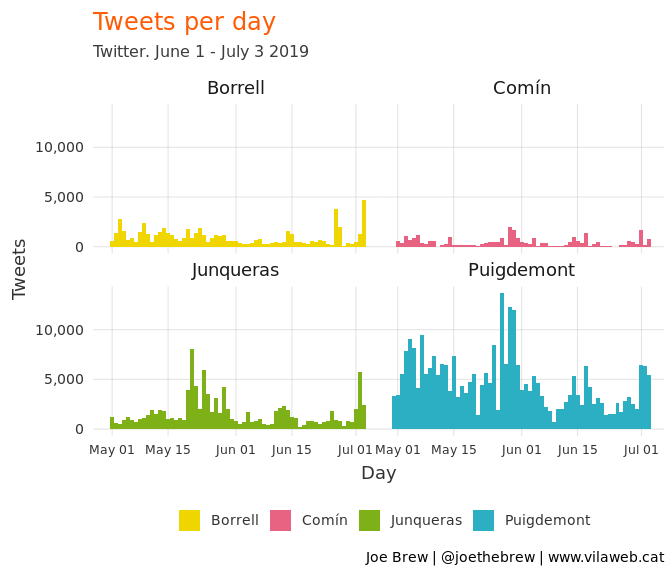
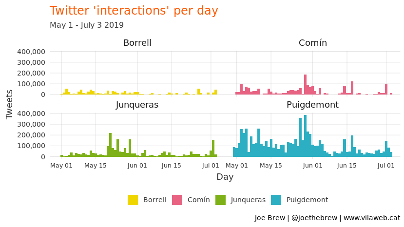
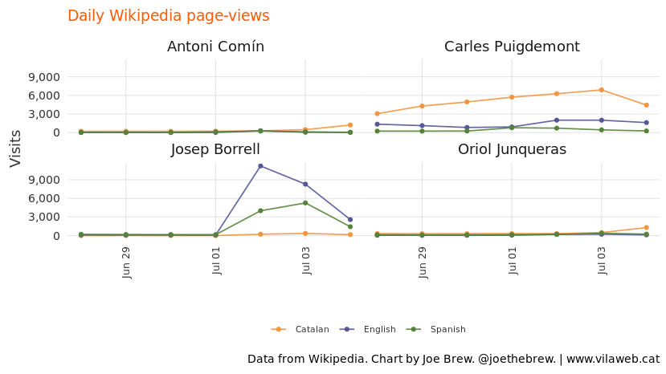
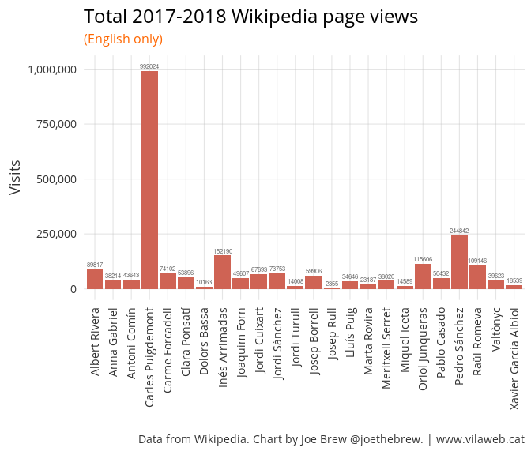
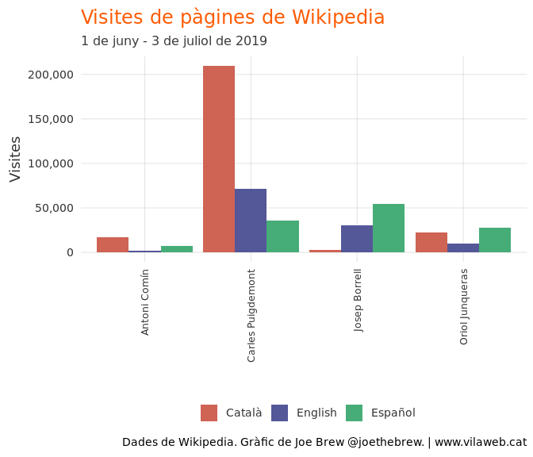
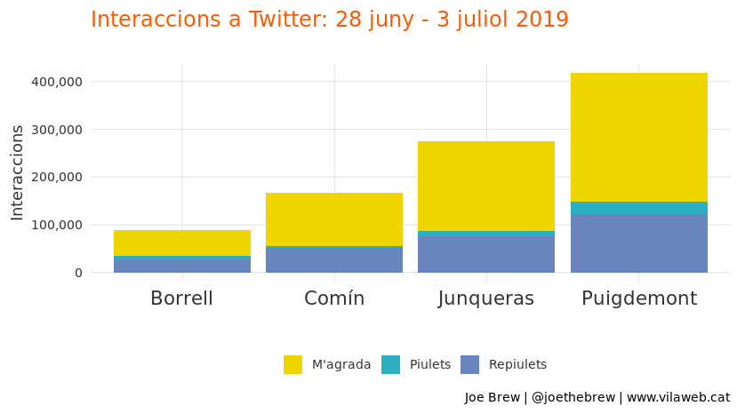
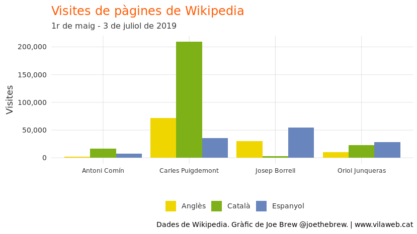

'Spain is back' ('España ha vuelto') but for all the wrong reasons
================

Alternative title: "Global Spain", we have a problem: Puigdemont and Junqueras - not Borrell - dominate the global conversation about Spain

Introduction
============

"España ha vuelto" ("Spain is back"). This is how Spanish President Pedro Sánchez described the outcome of the negotiations leading to the nomination of Josep Borrell (current Spanish Foreign Minister) as the EU's highest representative for foreign affairs. The phrase "Spain is back" is meant to convey Spain's return to a powerful, central role in European and global politics. The idea is that Spain will complete its transition from a "backwater" to a leader of the democratic world (replacing, to some extent, a UK plagued by Brexit and a US plagued by Trump), with Josep Borrell as the face of Europe to the rest of the world. People will be talking about Spain again.

To some extent, Sánchez is right. The shake-up in European politics following May's European elections has indeed lead to more people talking about Spain. But instead of talking about the new jobs of Spain's top diplomat (Borrell), people are talking about Carles Puigdemont, Toní Comín, and Oriol Junqueras. In other words, people are talking about Spain - but for all the wrong reasons.

Methods
=======

Data was gathered from two sources:

1.  [Wikipedia](https://www.wikipedia.org/), a popular online encyclopedia, which makes data on page visits [publicly available](https://tools.wmflabs.org/pageviews/?project=en.wikipedia.org&platform=all-access&agent=user&range=latest-20&pages=Cat%7CDog).

2.  [Twitter](https://www.twitter.com), a popular social network.

Our units of analysis were page-views (for Wikipedia) and mentions (for Twitter), the latter including both mentions of the person's last name and/or their twitter username.

The analysis consisted of comparing the frequency of page-views/mentions of four Catalans recently elected to the Catalan Parliament: Josep Borrell (the Spanish Foreign Minister who was recently nominated to lead EU foreign affairs) vs. pro-independence leaders Carles Puigdemont, Oriol Junqueras, and Toni Comín. They hypothesis was that if Spain had really returned to the world stage as a democratic leader, there would be more searches for and chatter about Borrell than the others; if, on the other hand, internet data revealed more activity around the 3 pro-independence leaders, it would suggest the opposite.

Results
=======

Twitter
-------

The below chart shows the total number of tweets mentioning the four politicians in question over the last few weeks.

In the above, it's clear that Borrell receives less attention than either Junqueras or Puigdemont, *even after* his nomination as head of external affairs for the EU. Borrell's peak of fewer than 5,000 tweets per day is lower than the number of tweets that Junqueras received some days during the election, and far lower than the number of tweets mentioning Puigdemont at the same time.

The raw number of tweets, however, is a poor indication of social network interest. Many tweets are automated or institutional, and some news stories - though tweeted - generate almost no interest. An alternative measure is "interactions" (the sum of tweets, retweets, and likes). Let's have a look at "interactions" mentioning the four politicians in question:

When retweets and likes are taken into account, it is clear that Borrell generates far less interest than any of the others. There is no noticable peak in retweets and likes following Borrell's nomination as head of external affairs; on the other hand, there are massive increases in retweets and likes mentioning Junqueras, Puigdemont, and Comín at the beginning of July.

Wikipedia
---------

The below chart shows the total number of page view for the four politics in question, in English, Catalan, and Spanish, over the last two months.

Josep Borrell had fewer than half of the English-language page-views than those of Carles Puigdemont (27,662 and 70,173, respectively).

Though Borrell's total surpassed those of Comín and Junqueras, it came largely in the last few days only. And the effect has died down significantly already:

Conclusion
==========

If the nomination of Josep Borrell as Europe's top diplomat was supposed to mark a change in era in regards to Spain's role and image, it appears not to be working. Though English-language Wikipedia page-views for Borrell increased sharply following Borrell's nomination, within three days they had reduced to less than 20% of their initial rise. And social network activity shows very little interest in Borrell, and much higher interest in Puigdemont, Comín, and Junqueras.

In other words, people on social media are talking more about Spain's imprisoned and exiled leaders than their leaders. Pedro Sánchez's intentions to associate Spain with leadership of the democratic world *abroad* are noble, but unlikely to succeed until the democratic problems *at home* are resolved. When a counry's exiles and prisoners are more famous than its leaders, achieving a significant leadership role among western democracies is

Catalan language plots
======================

Technical details
=================

Data were gathered from Wikipedia using the `pageviews` R package. Data were gathered from Twitter using the `twint` package. The code for this analysis is publicly available [here](https://github.com/joebrew/vilaweb/tree/master/analyses/wikipedia2).
