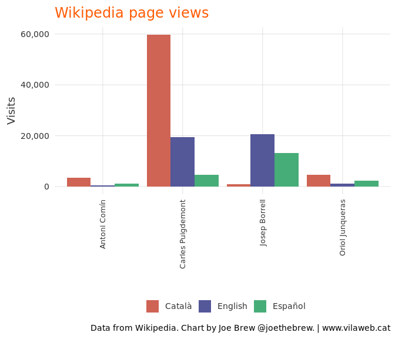
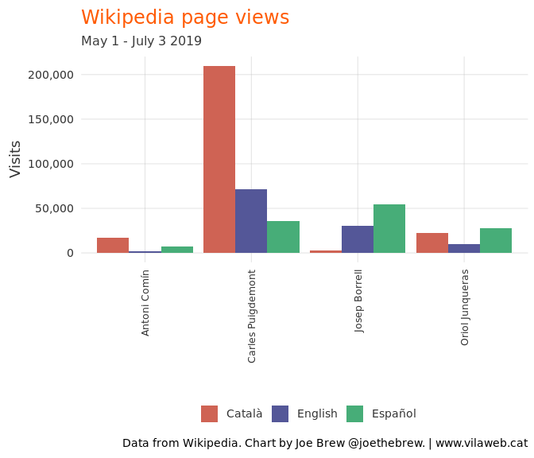

'Spain is back' ('España ha vuelto') but for all the wrong reasons
================

Alternative title: "Global Spain", we have a problem: Puigdemont and Junqueras - not Borrell - dominate the global conversation about Spain

Introduction
============

"España ha vuelto" ("Spain is back"). This is how Spanish President Pedro Sánchez described the outcome of the negotiations leading to the nomination of Josep Borrell (current Spanish Foreign Minister) as the EU's highest representative for foreign affairs. The phrase "Spain is back" is meant to convey Spain's return to a powerful, central role in European and global politics. The idea is that Spain will complete its transition from a "backwater" to a leader of the democratic world (replacing, to some extent, a UK plagued by Brexit and a US plagued by Trump), with Josep Borrell as the face of Europe to the rest of the world. People will be talking about Spain again.

To some extent, Sánchez is right. The shake-up in European politics following May's European elections has indeed lead to more people talking about Spain. But instead of talking about the new jobs of Spain's top diplomat (Borrell), people are talking about Carles Puigdemont, Toní Comín, and Oriol Junqueras. In other words, people are talking about Spain - but for all the wrong reasons.

Methods
=======

Data was gathered from two sources:

1.  [Wikipedia](https://www.wikipedia.org/), a popular online encyclopedia, which makes data on page visits [publicly available](https://tools.wmflabs.org/pageviews/?project=en.wikipedia.org&platform=all-access&agent=user&range=latest-20&pages=Cat%7CDog).

2.  [Twitter](https://www.twitter.com), a popular social network.

Our units of analysis were page-views (for Wikipedia) and mentions (for Twitter), the latter including both mentions of the person's last name and/or their twitter username.

The analysis consisted of comparing the frequency of page-views/mentions of four Catalans recently elected to the Catalan Parliament: Josep Borrell (the Spanish Foreign Minister who was recently nominated to lead EU foreign affairs) vs. pro-independence leaders Carles Puigdemont, Oriol Junqueras, and Toni Comín. They hypothesis was that if Spain had really returned to the world stage as a democratic leader, there would be more searches for and chatter about Borrell than the others; if, on the other hand, internet data revealed more activity around the 3 pro-independence leaders, it would suggest the opposite.

Results
=======

Twitter
-------

The below chart shows the total number of tweets mentioning the four politicians in question over the last few weeks.

    Error in seq.Date(min(agg$hour), max(agg$hour), by = "hour"): invalid string for 'by'

    Error: cannot join a Date object with an object that is not a Date object

Wikipedia
---------

The below chart shows the total number of page view for the four politics in question, in English, Catalan, and Spanish, over the last x weeks.

Conclusion
==========

Both Wikipedia and Twitter data indicate the same general phenomenon: people are talking more about Spain's prisoners than their leaders. Pedro Sánchez's intentions to associate Spain with leadership of the democratic world abroad are noble, but unlikely to succeed until the democratic problems "at home" are resolved.

Technical details
=================

Data were gathered from Wikipedia in January 2019 using the `pageviews` R package. The code for this analysis is publicly available [here](https://github.com/joebrew/vilaweb/tree/master/analyses/wikipedia). The already-gathered data is also available [here](https://raw.githubusercontent.com/joebrew/vilaweb/master/analyses/wikipedia/wiki_data_2017-2018.csv).
