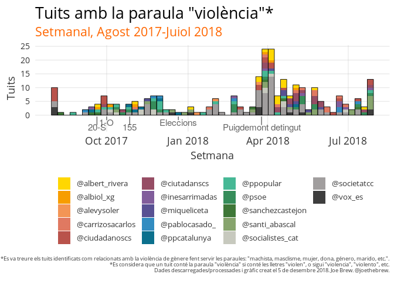
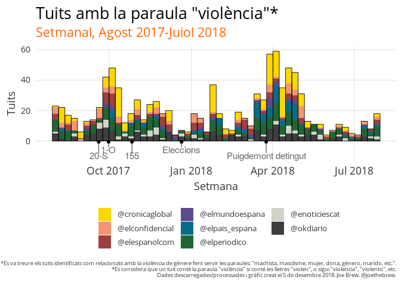
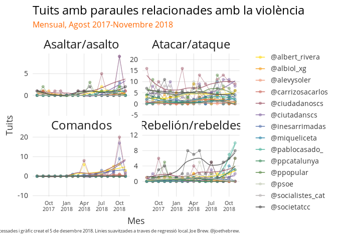
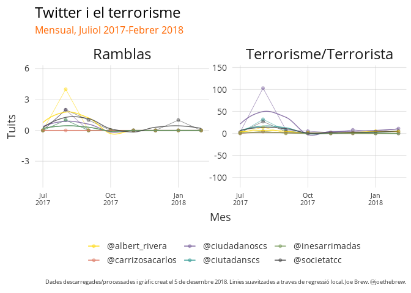

Technical notes: The tall tale of violence
================

Executive summary
-----------------

This document contains a technical / methodological explanation of the analysis carried out for the article "The tall tale of violence", published [HERE](https://english.vilaweb.cat/noticies/the-tall-tale-of-violence/).

Overview
--------

The study examined the frequency of use of the term "violence" (as well as the related terms "violent", etc.) on twitter among well-known pro-union Spanish and Catalan politicians. Given that there is a great deal of controversy in Spain regarding whether the charge of "rebellion" - a crime which, [by definition in the Spanish Penal Code](https://www.legislationline.org/download/action/download/id/6443/file/Spain_CC_am2013_en.pdf), requires violence - is appropriate, the purpose of this study was to see examine the frequency of the word "violence" on twitter to see if there was notable violence in Catalonia.

The hypothesis
--------------

#### If violence took place, then politicians will have talked about it.

If there was indeed a violent uprising or violent rebellion in Catalonia in September and October of 2017, we would expect that Catalan and Spanish politicians, particularly those most opposed to indepenence, will have noticed, talked, and tweeted about the violence.

The data
--------

We examined tweets from the year beginning in August 2017. We limited our analysis to individuals and groups which are most opposed to the Catalan independence movement, since these accounts were most likely to discuss the supposed violence of independentists. In total, our analysis covered 313120 tweets from 25 twitter accounts.

#### Acquiring data

We "scraped" twitter for all publicly available tweets from the following accounts. Data were acquired on 5 December 2018. Tools from the open source [python twint library](https://github.com/twintproject/twint) were used, as well as custom code in R (publicly available [here](https://github.com/joebrew/vilaweb/blob/master/inst/rmd/el_relat_de_la_violencia/get_data.R)).

The methods
-----------

#### Filtering data

Having acquired data, we searched all tweets for the string "violen". As the root of the word "violence", "violencia", "violentos", etc. it captured tweets about violence. In order to reduce noise, we filtered out tweets about domestic/gender violence, using the following search string:

``` r
'machis|masclis|mujer|dona|done|géner|gèner|genero|marido|marit|novio|esposa|novia|doméstic|domèstic'
```

(In the above, the vertical bar can be understood as meaning "OR")

We restricted our analysis to the 1 year period between August 1, 2017 and July 31, 2018.

#### Aggregation and counting

We grouped the resultant data by person/account and calendar month, and calculated the sum of the total number of violence-flagged tweets (excluding those flagged as domestic/gender violence) for each person-month.

The results
-----------

#### Tweets from politicians and parties

The below chart shows all tweets containing the words violence/violent during the time period in question (excluding tweets algorithmically identified as being specific to gender/domestic violence).


### Tweets about violence from newspapers

Newspapers followed a similar trend, albeit with more emphasis on violence in September and October of 2017. However, nearly all coverage of September/October 2017 violence by newspapers was of violence carried out *by the State*, not against the State.


Other violence related words
----------------------------

Among certain accounts (), a similar trend emerges if we examine other violence-related words, such as "assault", "attack", "comandos" and "rebellion". The exact search strings used for this were:

``` r
attack: 'atac|ataq' (ie, atacar, ataque, ataques, atacado)
rebellion: 'rebel' (ie, rebelión, rebeldes, rebelar)
comandos: 'comando' (ie, comandos)
assault: 'asalt' (ie, asaltar, asalto, asaltan)
```

With the exception of the August 2017 peak with the word "attack" (a function of the terrorist attack on the Ramblas at that time), references to violent words among mainstraim Spanish and Catalan politicians were *low* during the supposed violent rebellion of the Catalan independence movement, but have been increasing since.


### Comparison with actual violent event

The trend of using event-related violence words at a low frequency, but then increasing their usage over time is the exact *opposite* of how reality is usually perceived and discussed. For example, if we examine the use of the words "terror" ("terrorism", "terrorist", etc.) and "rambla" (the location of the August 2017 terrorist attack) among the same group of accounts, we say that there is an initial spike in attention, followed by a long decline (see below chart). This is normal for newsworthy events.


The above chart shows the normal relationship between and event and words related to the event. The terrorist attack of august 2017 certainly occurred - there is no debate about that. And the tweet-trail of the terrorist attack is normal - high attention immediately after the event, followed by a decline. What is *abnormal* is the fact that there was a supposed, major event (violent rebellion/uprising) which very few perceived as violent at the moment of the event. And the tweet trail of the violent rebellion takes on the opposite form: more people talked about the "violence" of the "rebellion" many *months* after it took place than in the immediate days after.

Raw data
--------

The raw data (number of tweets of each type for each account for each month) is viewable [here](https://github.com/joebrew/vilaweb/blob/master/inst/rmd/el_relat_de_la_violencia/data_outputs/raw_data.csv)

### Technical details

All of the code for this analysis is open-source and available at <https://github.com/joebrew/vilaweb>.

Follow Joe Brew on twitter at @joethebrew.

Catalan language plots
----------------------



    Error in make_special_plot("ca"): could not find function "make_special_plot"


