The tall tale of violence
================

### El relat de la violència

The question
------------

#### Was there a violent rebellion in Catalonia in September and October of 2017?

9 Catalan social and political leaders are currently in pre-trial prison for their involvement in organizing and promoting an independence referendum last autumn. They are being charged by the State with rebellion, a crime which, [by definition in the Spanish Penal Code](https://www.legislationline.org/download/action/download/id/6443/file/Spain_CC_am2013_en.pdf), requires violence. But are the imprisoned leaders violent rebels? Or are the charges a fabrication meant to halt the independence movement by means of decapiting its leadership through long, exemplary jail sentences .

The hypothesis
--------------

#### If violence took place, then politicians will have talked about it.

If there was indeed a violent uprising or violent rebellion in Catalonia in September and October of 2017, we would expect that Catalan and Spanish politicians, particularly those most opposed to indepenence, will have noticed, talked, and tweeted about the violence. Let's take a look at twitter data from the period of the supposed violent uprising, and see who was talking about violence.

The data
--------

We examined tweets from the year beginning in August 2017. We limited our analysis to individuals and groups which are most opposed to the Catalan independence movement, since these accounts were most likely to discuss the supposed violence of independentists. In total, our analysis covered 313120 tweets from 25 twitter accounts.

The results
-----------

### Tweets from politicians and parties

The below chart shows all tweets containing the words violence/violent during the time period in question (excluding tweets algorithmically identified as being specific to gender violence).

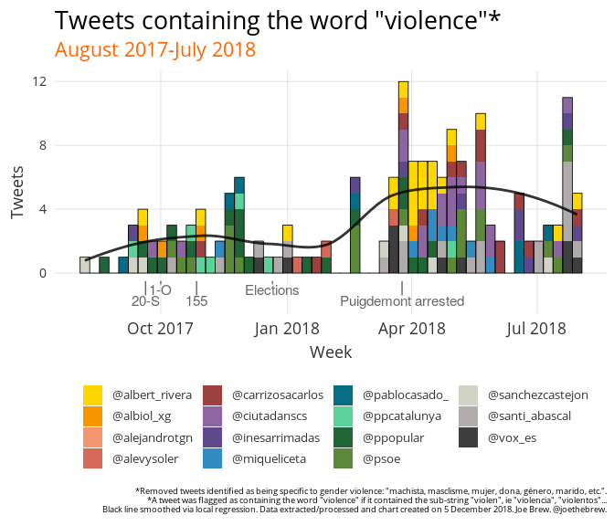

It is clear in the above chart that tweets about "violence" did not spike during the supposed violent events. Anti-independence politicians did not mention violence in the immediate aftermath of "violent uprising".

For example, the Partido Popular made no mentions of "violence" during the 3 days following the September 20th protest for which "the Jordis" are now imprisoned. However, on September 24th, they - along with now Spanish President Pedro Sánchez (who also made no mentions of the "violence" of September 20th) - tweeted about an unrelated assault in Zaragoza:

<table style="width:100%">
<tr>
    <td>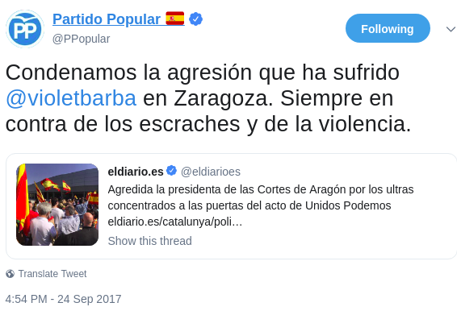</td>
    <td>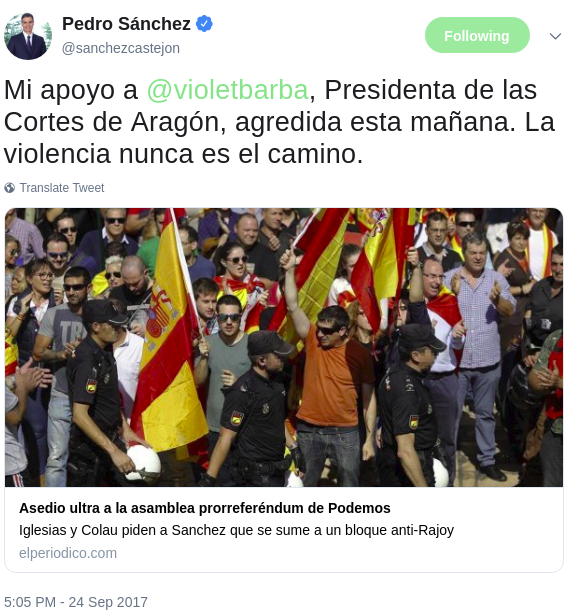</td>

</tr>
</table>
Why condemn the "violence" of an assault in Zaragoza, but not of a rebellion in Catalonia?

Meanwhile, socialist Miquel Iceta's only tweet containing the term "violence" during the two crucial weeks of the "rebellion" (September 20th until October 3rd) was on September 22nd. However, it wasn't about the suposed violence of pro-independence protests; rather, it was about an aggression by a right-wing protestor against the pro-independence ANC group. During these same two weeks, Inés Arrimadas' only tweet was about gender violence.

<table style="width:100%">
<tr>
    <td></td>
    <td>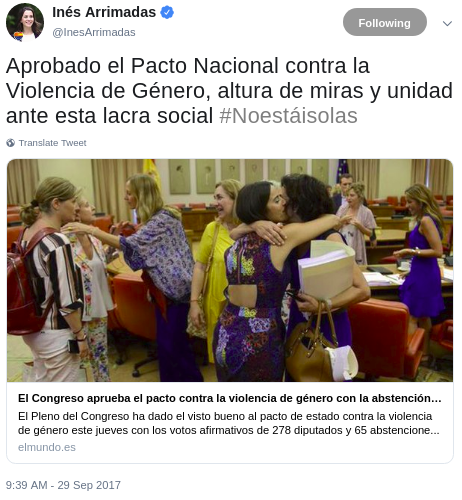</td>

</tr>
</table>
On the day after the "violent uprising" of September 20th, Inés Arrimadas tweeted about budgets, World Alzheimer day, the fight against corruption - but no mention of violence. Xavier García Albiol tweeted about the Espanyol football team, and the 17th anniversary of the assassination of José Luis Ruiz Casado by ETA - but no mention of the "violence" the previous night. Even VOX, which tweeted about the September 20th protests, used the word "acosar" ("harass") to describe what pro-independence protestors were doing, but not violent language. Clearly, no one saw violence.

Rather, the peak in tweets mentioning the word violence did not occur until late March and April of 2018 - precisely the time at which Puigdemont was detained in Germany. The increase in tweets about violence remained high for several weeks during Puigdemont's detention. For example, Albert Rivera, whose only tweet mentioning the term "violence" in September and October 2017 (the period of the supposed violent rebellion) pertained to [gender violence](https://twitter.com/Albert_Rivera/status/913379945455538176), tweeted several articles associating violence and Catalan nationalism.

<table style="width:100%">
<tr>
    <td></td>
    <td></td>

</tr>
</table>
 

### Tweets about violence from newspapers

Newspapers followed a similar trend, albeit with more emphasis on violence in September and October of 2017. However, nearly all coverage of September/October 2017 violence by newspapers was of violence carried out *by the State*, not against the State. For example, of the 16 articles on October 2 published by El País, El Confidencial, El Español, El Mundo and El Periódico with the term "violence", 0 referred to violence carried out by the pro-independence camp; all 16 referred to police violence.

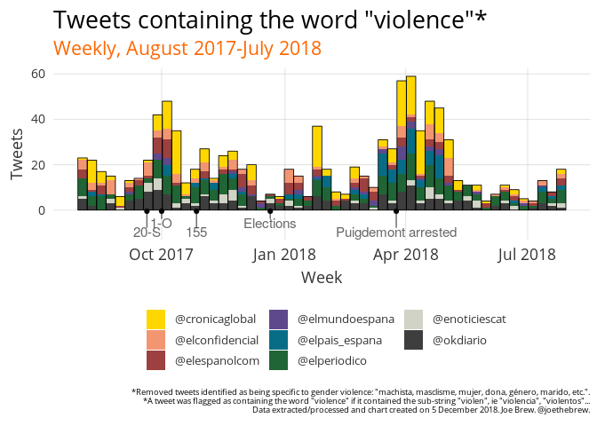

The peak in the term "violence" in newspaper tweets did not come during the supposed violent rebellion, but in late March / early April 2018, at the time of the Puigdemont arrest. For example, Crónica Global began putting out frequent tweets for articles related to the violence of the independence movement.

<table style="width:100%">
<tr>
    <td></td>
    <td>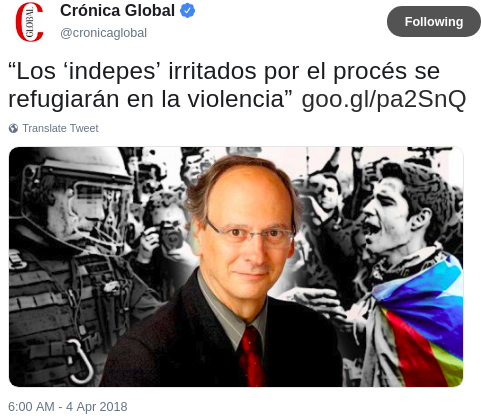</td>

</tr>
</table>
Other pro-union news outlets also began using the term "violence" and "violent" with greater frequency.

<table style="width:100%">
<tr>
    <td>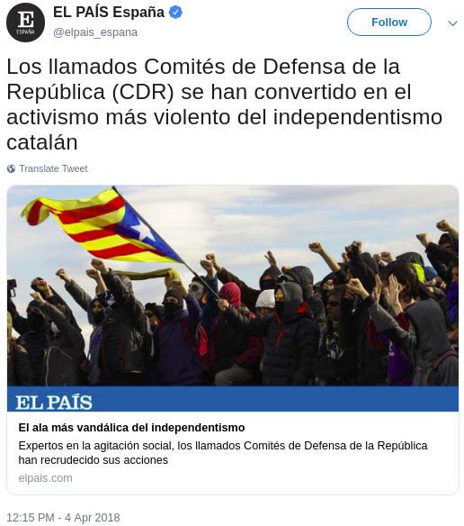</td>
    <td></td>

</tr>
</table>
Now that the narrative of a violent independence movement had been established, others (who had previously refrained from accusing the independence movement of violence) began to jump on board. For example, in mid-April, Miquel Iceta denounced "violent sectors" of the independence movement, just a few days after Societat Civil Catalana implied that violence was prevalent in Catalonia.

<table style="width:100%">
<tr>
    <td>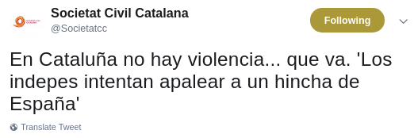</td>
    <td>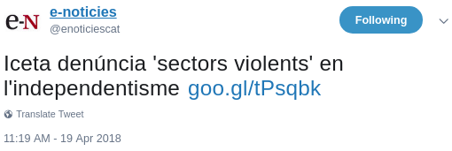</td>

</tr>
</table>
 

The most interesting aspect of the spike in mentions of "violence" in April 2018 is not that it occurred (one could make the case that there was an increase in protestor-police confrontations at the time). Rather, the most interesting thing about April 2018 was that the frequency of the use of the term violence was *much* greater than in September and October of 2018, during the supposed violent uprising.

### The curious case of Ciudadanos and Societat Civil Catalana

In the above we've seen that tweets about violence largely occurred many months *after* the supposed violent rebellion for which Catalan political leaders are being charged. If there is any one party which best encapsulates this trend it is Ciudadanos. Both its leaders and official accounts wrote rarely or never about violence during the "rebellion", but began mentioning violence with a significantly higher frequency beginning in the spring of 2018. Societat Civil Catalana, a pro-union advocacy group, had a very similar frequency of violence-related tweets. Mentions of violence were highest in April of 2018 (during the Puigdemont extradition period). Additionally, mentions of "violence" from these accounts were significantly higher in October 2018 than in October 2017, an odd fact given that a "violent rebellion" supposedly took place during the latter period.

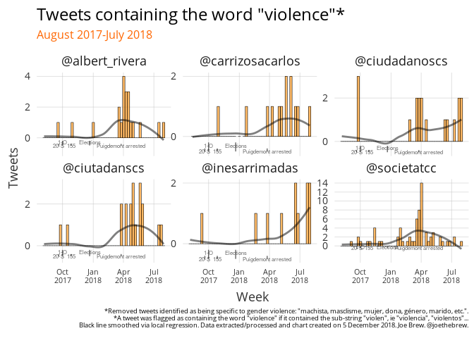

Among these accounts (Ciudadanos and SCC), a similar trend emerges if we examine other violence-related words, such as "assault", "attack", "comandos" and "rebellion". With the exception of the August 2017 peak with the word "attack" (a function of the terrorist attack on the Ramblas at that time), references to violent words were *low* during the supposed violent rebellion of the Catalan independence movement, but have been increasing since.

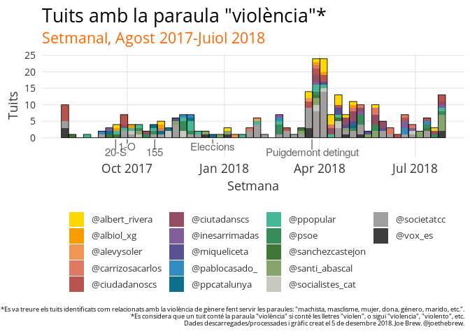

Is violence in Catalonia greater now than it was a year ago? Or has the narrative simply coalesced more clearly around violence?

The trend of using event-related violence words at a low frequency, but then increasing their usage over time is the exact *opposite* of how reality is usually perceived and discussed. For example, if we examine the use of the words "terror" ("terrorism", "terrorist", etc.) and "Rambla" (the location of the August 2017 terrorist attack) among the same group of accounts, we say that there is an initial spike in attention, followed by a long decline (see below chart). This is normal for newsworthy events.

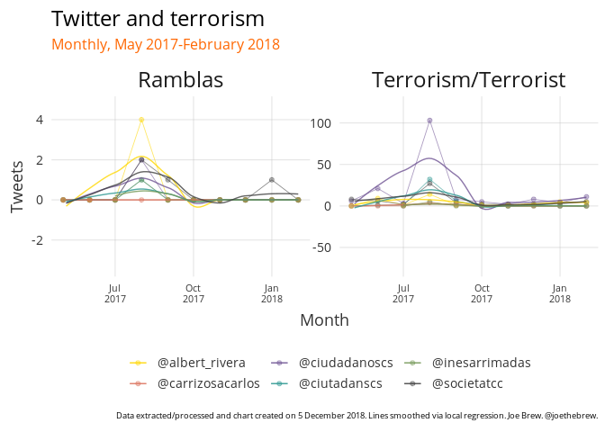

The above chart shows the normal relationship between and event and words related to the event. The terrorist attack of august 2017 certainly occurred - there is no debate about that. And the tweet-trail of the event is normal - high attention immediately after the event, followed by a decline. What is *abnormal* is the fact that there was a supposed event (violent rebellion/uprising) which very few perceived at the moment of the event. And the tweet trail of the violent rebellion takes on the opposite form: more people talked about the "violence" of the "rebellion" many *months* after it took place than in the immediate days after Could it be that a violent rebellion simply did not take place?

Qualitative interpretation
--------------------------

Is Twitter the objective arbiter of reality? Of course not. But it is still useful.

Among pro-union politicians, political parties, and newspapers, the frequency of the word "violence" was relatively low during the supposed "violent" rebellion of Catalonia, and has increased over time. Whereas virtually no pro-union politicians mentioned violence during and immediately after the events for which Catalan independence leaders are now being charged with crimes, many began to mention the term with increasing frequency during 2018.

One cannot examine these data without at least asking the question: If there was really a violent rebellion, why did nobody talk about it until much later?

The data only tell us what was said on twitter, not why. But the political reality helps one to make some conclusions. In the days surrounding the Catalan self-determination referendum, the anti-independence actors had not coalesced around one strategy. The initial tactic of simply preventing the referendum by confiscating materials failed; then, trying to scare voters from casting a ballot also failed. The independence movement, in early October, appeared unstoppable.

Finally, a strategy emerged: "behead" independence leadership through preventive, exemplary imprisonment. The strategy was initially effective insofar as it threw the independence movement into disarray and effectively silenced many of its protagonists. However, it was unsustainable: jailing politicians and preventing them from exercising their elected office is not permitted in democracies. Unless, of course, those politicians are guilty of blood crimes.

When one understands this - that the accusation of violence is not based on reality, but rather on a political strategy - than the fact that the tweet-trail about violence does not correspond with reality should come as no surprise. Anti-independence politicians did not tweet about pro-independence violence in September and October of 2017 for one simple reason: there was none.

And they began tweeting so frequently about it later fron one simple reason: because they needed there to be violence to justify continued imprisonment of their political opponents.

When it became apparent that judicializing the political conflict was an effective means to take momentum away from the independence movement, a convenient narrative emerged. The tale of pro-independence violence was so fantastical - so unbelievable - at first that it did not fully cement itself into the political paradigm until months later, reaching its peak in the spring during the extradition proceedings for Carles Puigdemont. Now the tale has been told enough times that it has simply become dogma for many - the frequency of the term "violence" by pro-union politicians is higher now than it was during the "rebellion".

Perhaps Ciudadanos' Carlos Carrizosa explained the phenomenon best in a quote tweeted by his political party in April: "Let's recall that Puigdemont declared independence in Catalonia and therefore there were acts that can be considered violent".

<table style="width:100%">
<tr>
    <td>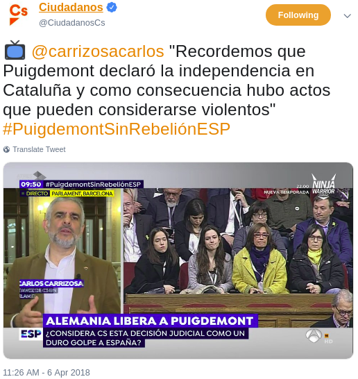</td>

</tr>
</table>
The rationale of the above is simply incoherent, both chronologically and logically.

One of the benefits of living in the era of "big data" is that we can look back on things as they were, and not simply as we remember them. On the morning of September 21st, the day after the "violent uprising" lead by Jordi Sánchez and Jordi Cuixart, their political opponents woke up, read the news, and tweeted about many things. But not about violence.

And on the morning of October 2nd, the day after the "violent rebellion" for which nearly a dozen Catalan leaders are currently in prison or exile, Andrey Levy wrote about "sentimental rupture" - not violence. Inés Arrimadas tweeted about the "failure" of the referendum - not about violence. Albert Rivera wrote about the need for elections - not about violence. Miquel Iceta retweeted articles about the ineptitude of Rajoy - not about the violence of those who wanted to vote on independence. And the next day, the King of Spain, in what has now become an infamous pro-union speech, spoke of the "unacceptable disobedience" of independence leaders - but not about violence. If there was violence, why did nobody talk about it then?

Maybe the increase in tweets about the "violence" of Catalan independence leaders did not come until so much later because that's how long it took to forget what had really happened.

Fortunately, we have data to help us remember the truth.

### Technical details

All of the code for this analysis is open-source and available at <https://github.com/joebrew/vilaweb>.

Follow Joe Brew on twitter at @joethebrew.

Catalan language plots
----------------------

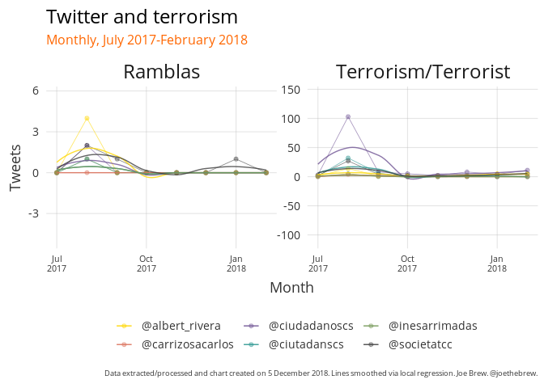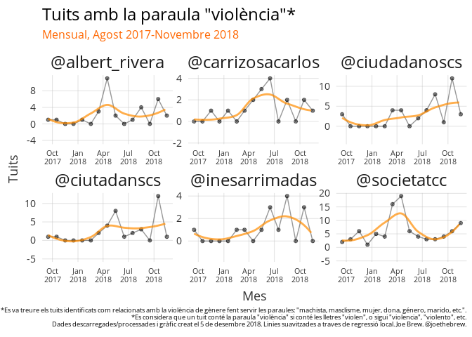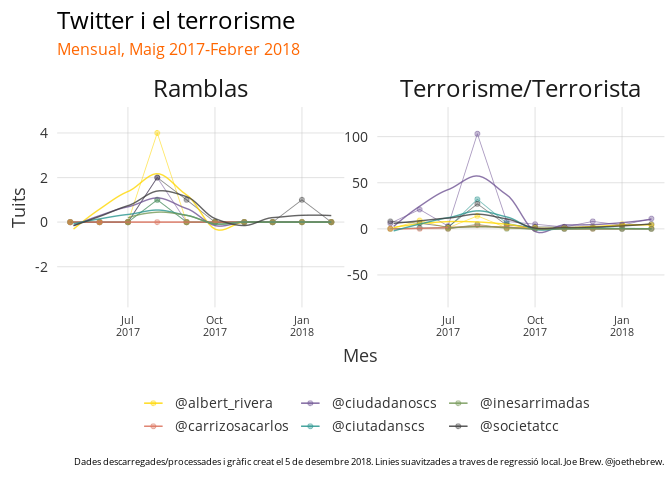
