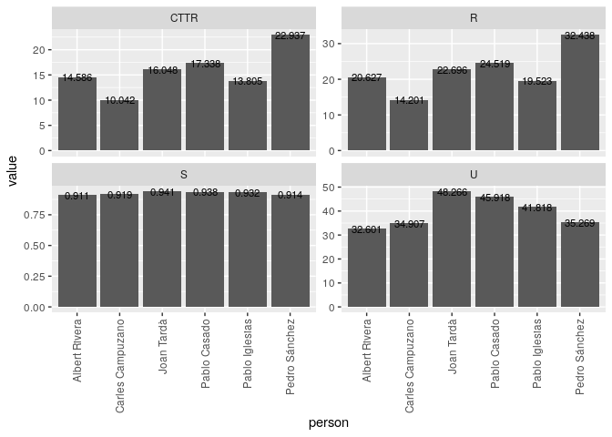
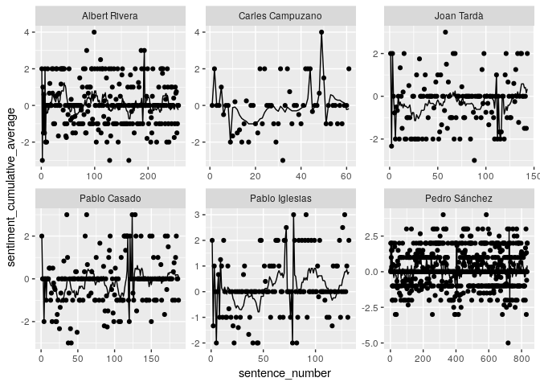

Sesión de control
================

Catalonia and Brexit: An analysis of Pedro Sánchez's December 2018 speech to Congress (and reactions to it)
-----------------------------------------------------------------------------------------------------------

On Wednesday, December 12th, Spanish President Pedro Sánchez delivered an address to the Congreso de los Diputados regarding Brexit and the political situation in Catalonia ([official transcription here](http://www.congreso.es/public_oficiales/L12/CONG/DS/PL/DSCD-12-PL-170.PDF)). The speech reflected rising tensions between pro-independence Catalans and the pro-union Sánchez government, and marked a sharp break with Sánchez's previous more conciliatory tone. The following back-and-forth between Sánchez and the leaders of other major Spanish political parties was tense.

What follows is linguistic analysis of the speeches and counter-speeches of 6 politicians:

-   Pedro Sánchez (President, PSOE, unionist)
-   Pablo Casado (PP, unionist)
-   Albert Rivera (Ciudadanos, unionist)
-   Pablo Iglesias (Podemos, ambivalent)
-   Carles Campuzano (PDeCat, independentist)
-   Joan Tardà (Catalan Left, independentist)

The questions
-------------

1.  Are there differences in "polarity" (postivity-negativity) between the different politicians' speeches?

2.  Are there differences in the frequency of violence-associated words between the different politicians' speeches?

3.  What is the relationship between emotional polarity and references to Catalonia?

The methods
-----------

We

    # A tibble: 2 x 3
      catalan polarity   viol
      <lgl>      <dbl>  <dbl>
    1 FALSE      0.145 0.0296
    2 TRUE      -0.140 0.0636

    # A tibble: 2 x 2
      spanish polarity
      <lgl>      <dbl>
    1 FALSE     0.118 
    2 TRUE     -0.0374
