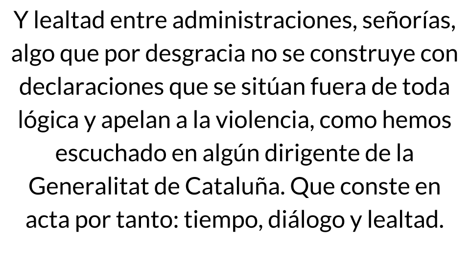
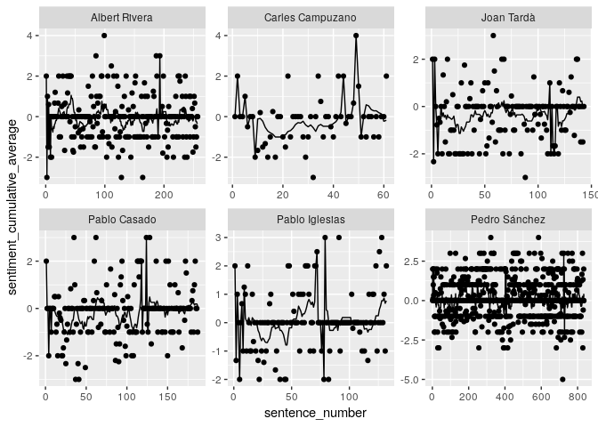

Analysis of congressional speeches
================

Catalonia, Brexit, and Violence: An analysis of Pedro Sánchez's December 2018 speech to Congress (and reactions to it)
----------------------------------------------------------------------------------------------------------------------

On Wednesday, December 12th, Spanish President Pedro Sánchez delivered an address to the Congreso de los Diputados regarding Brexit and the political situation in Catalonia ([official transcription here](http://www.congreso.es/public_oficiales/L12/CONG/DS/PL/DSCD-12-PL-170.PDF)). The speech reflected rising tensions between pro-independence Catalans and the pro-union Sánchez government, and marked a sharp break with Sánchez's previous more conciliatory tone. The following back-and-forth between Sánchez and the leaders of other major Spanish political parties was tense.

What follows is linguistic analysis of the speeches and counter-speeches of 6 politicians:

-   Pedro Sánchez (President, PSOE, unionist)
-   Pablo Casado (PP, unionist)
-   Albert Rivera (Ciudadanos, unionist)
-   Pablo Iglesias (Podemos, ambivalent)
-   Carles Campuzano (PDeCat, independentist)
-   Joan Tardà (Catalan Left, independentist)

The questions
-------------

1.  Are there differences in "polarity" (postivity-negativity) between the different politicians' speeches?

2.  Are there differences in the frequency of violence-associated words between the different politicians' speeches?

3.  What is the relationship between emotional polarity and references to Catalonia?

The methods
-----------

We digitized the speeches from December 12 into a [machine-readable format](https://github.com/joebrew/vilaweb/blob/master/inst/rmd/sesion_de_control/data/transcript.csv), and then used an algorithm based on the [AFINN library](http://www2.imm.dtu.dk/pubdb/views/publication_details.php?id=6010) (a dictionary of words with assigned sentimental polarity) to classify each sentence's average emotional direction. The below is an example of how the algorithm works.

<table style="width:100%">
<tr>
    <td></td>
    <td></td>

</tr>
</table>
          example_split  x
    1                 y  0
    2           lealtad  3
    3             entre  0
    4  administraciones  0
    5          señorías  0
    6              algo  0
    7               que  0
    8               por  0
    9         desgracia -2
    10               no -1
    11               se  0
    12        construye  0
    13              con  0
    14    declaraciones  0
    15              que  0
    16               se  0
    17           sitúan  0
    18            fuera  0
    19               de  0
    20             toda  0
    21           lógica  0
    22                y  0
    23           apelan  0
    24                a  0
    25               la  0
    26        violencia -3
    27             como  0
    28            hemos  0
    29        escuchado  0
    30               en  0
    31            algún  0
    32        dirigente  0
    33               de  0
    34               la  0
    35      generalitat  0
    36               de  0
    37         cataluña  0
    38              que  0
    39           conste  0
    40               en  0
    41             acta  0
    42              por  0
    43            tanto  0
    44           tiempo -2
    45          diálogo  0
    46                y  0
    47          lealtad  3

    # A tibble: 2 x 3
      catalan polarity   viol
      <lgl>      <dbl>  <dbl>
    1 FALSE     0.0595 0.0397
    2 TRUE     -0.150  0.0727

    # A tibble: 2 x 2
      spanish polarity
      <lgl>      <dbl>
    1 FALSE     0.0317
    2 TRUE     -0.0436
