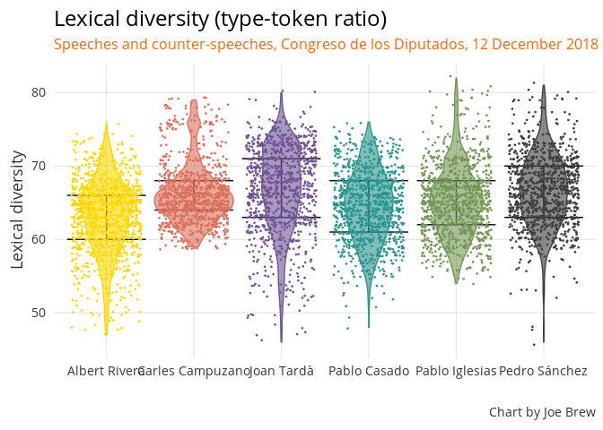

Analysis of congressional speeches
================

Catalonia, Brexit, and Violence: An analysis of Pedro Sánchez's December 2018 speech to Congress (and reactions to it)
----------------------------------------------------------------------------------------------------------------------

On Wednesday, December 12th, Spanish President Pedro Sánchez delivered an address to the Congreso de los Diputados regarding Brexit and the political situation in Catalonia ([official transcription here](http://www.congreso.es/public_oficiales/L12/CONG/DS/PL/DSCD-12-PL-170.PDF)). The speech reflected rising tensions between pro-independence Catalans and the pro-union Sánchez government, and marked a sharp break with Sánchez's previous more conciliatory tone towards Catalonia. The following back-and-forth between Sánchez and the leaders of other major Spanish political parties was tense, and marked by repeated references to violence.

What follows is linguistic analysis of the speeches and counter-speeches of 6 politicians:

-   Pedro Sánchez (President, PSOE, unionist)
-   Pablo Casado (PP, unionist)
-   Albert Rivera (Ciudadanos, unionist)
-   Pablo Iglesias (Podemos, ambivalent)
-   Carles Campuzano (PDeCat, independentist)
-   Joan Tardà (Catalan Left, independentist)

The questions
-------------

1.  Are there differences in "polarity" (postivity-negativity) between the different politicians' speeches?

2.  Are there differences in the frequency of violence-associated words between the different politicians' speeches?

3.  What is the relationship between emotional polarity, violence and references to Catalonia?

The methods
-----------

We digitized the speeches from December 12 into a [machine-readable format](https://github.com/joebrew/vilaweb/blob/master/inst/rmd/sesion_de_control/data/transcript.csv), and then used an algorithm based on the [AFINN library](http://www2.imm.dtu.dk/pubdb/views/publication_details.php?id=6010) (a dictionary of words with assigned sentimental polarity) to classify each sentence's average emotional direction. Certain words are categorized as positive or negative, with -5 being the most negative (for example, "bastard", "slut") and +5 being the most positive (for example, "superb" (magnífico) or "thrilled" (encantado)). The majority of words do not have an emotional weight ("to act", "administration", etc.) and are classified as 0. The average of a sentence's emotionally-weighted words constitute its positivity.

The below is an example of how the algorithm works on an ctual sentene from the speech. The sentence contained some negative words and some positive words, and was classified as neutral.

<table style="width:100%">
<tr>
    <td></td>

</tr>
</table>
We ran the algorithm on the entire content of speeches, and analyzed trends in positivity. We also tabulated word frequencies and associations.

The results
-----------

### Overall positivity

### Frequency of violent words

### Positivity over course of speech

Lexical diversity
=================

    # A tibble: 2 x 3
      catalan polarity   viol
      <lgl>      <dbl>  <dbl>
    1 FALSE    -0.0199 0.0397
    2 TRUE     -0.178  0.0727

    # A tibble: 2 x 2
      spanish polarity
      <lgl>      <dbl>
    1 FALSE    -0.0464
    2 TRUE     -0.0752
